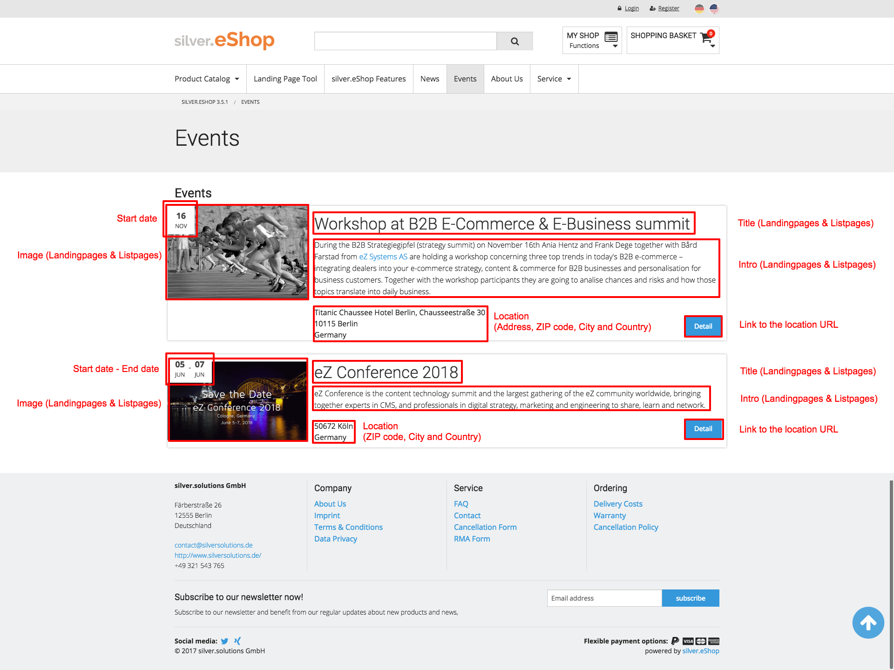
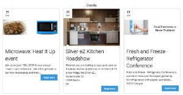

#  Event 

    

Events can be displayed on landingpages as well:

!!! info "Detail view"

    Events have currently no detail view but the attribute are existing.

## Content class

|Category|Name|Identifier|Type|Description|
|--------|----|----------|----|-----------|
|Content|Internal name|internal_name|Text line|Internal name will be used and shown only in the backend (recommended for multilingual environments)|
|Content|Title|title|Text line|Title will be shown in navigation, breadcrumb and on detailpages. (also used as fallback for landingpages and listpages)|
|Content|Intro|intro|XML block|Intro text will be shown on detailpages. (also used as fallback for landingpages and listpages)|
|Content|Body|body|XML block|Body text will be shown on detailpages.|
|Content|Media|media|Object relations|Images and videos for detailpages (also used as fallback for landingpages and listpages)|
|Content|Start date|	date|	Date|	The start date of the event.|
|Content|End date|	date|	Date|	The end date of the event.|
|Landingpages and Listpages|Title|	alternative_title|	Text line|	This title will be shown on landingpages or listpages (if empty the common title will be used)|
|Landingpages and Listpages|Intro	|alternative_intro|	XML block|	This intro text will be shown on landingpages or listpages (if empty the common intro text will be used)|
|Landingpages and Listpages|Image|	alternative_image|	Object relation|	This image will be shown on landingpages or listpages (if empty the first image of the "Media" attribute will be used)|
|Location|Address|	address|	Text line|	Street will be shown as part of the location address.|
|Location|Zip code|	zipcode|	Text line|	ZIP code will be shown as part of the location address.|
|Location|City|	city|	Text line|	Name of the city will be shown as part of the location address.|
|Location|Country|	country|	SesSelection|	Country will be shown as part of the location address.|
|Location|Map location|	map_location|	GMap Location|	Geocoordinates of the location (are not shown in the frontend)|
|Location|URL|	url|	Text line|	URL of the event|
|Meta|Meta title|	meta_title|	Text line|	Meta title for SEO|
|Meta|Meta description|	meta_description|	Text line|	Meta description for SEO|
|Meta|Meta keywords|	meta_keywords|	Text line|	Meta keywords for SEO|

## Create

You can create an event only as a child of a "Folder" oder "Folder (Events)". 

Note: Events are not shown if the set date lies in the past. So make sure the date lies in the future.
