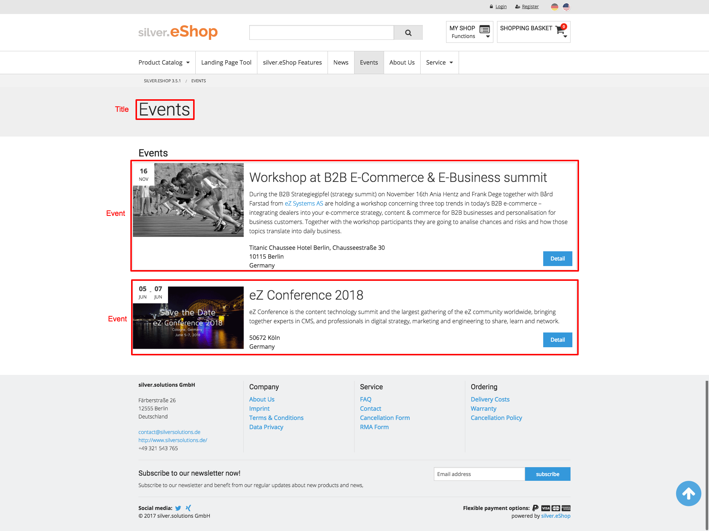

# Folder (Events)

Special folder to show events.

## Content class

|Category|Name|Identifier|Type|Description|
|--------|----|----------|----|-----------|
|Content|Internal name|internal_name|Text line|Internal name will be used and shown only in the backend (recommended for multilingual environments)|
|Content|Title|title|Text line|Title will be shown in navigation, breadcrumb and on detailpages. (also used as fallback for landingpages and listpages)|
|Content|Intro|intro|XML block|Intro text will be shown on detailpages. (also used as fallback for landingpages and listpages)|
|Content|Body|body|XML block|Body text will be shown on detailpages.|
|Content|Media|media|Object relations|Images and videos for detailpages (also used as fallback for landingpages and listpages)|
|Content|Layout|	layout|	Layout|	eZ Flow blocks and elements|
|Landingpages and Listpages|Title|	alternative_title|	Text line|	This title will be shown on landingpages or listpages (if empty the common title will be used)|
|Landingpages and Listpages|Intro	|alternative_intro|	XML block|	This intro text will be shown on landingpages or listpages (if empty the common intro text will be used)|
|Landingpages and Listpages|Image|	alternative_image|	Object relation|	This image will be shown on landingpages or listpages (if empty the first image of the "Media" attribute will be used)|
|Meta|Meta title|	meta_title|	Text line|	Meta title for SEO|
|Meta|Meta description|	meta_description|	Text line|	Meta description for SEO|
|Meta|Meta keywords|	meta_keywords|	Text line|	Meta keywords for SEO|

## Definition of what will be fetched and shown.

There is a special list definition configured in configuration files.

The editor can create folders inside this folder to organize events (e.g. fairs or workshops).  
Events will be fetched with a depth of two and shown grouped by folder.  
If the events are grouped a inside navigation with anchors to the groups will be visible on top of the page.

Events will be fetched only if the "End date" is today or newer.

- **Layout:** list view  
- **Depth:** 2  
- **Classes:** event  
- **Items per page:** 10  
- **Sort by:** "Start date" (ascending)

### Create

You can create a folder everywhere in the content structure.
