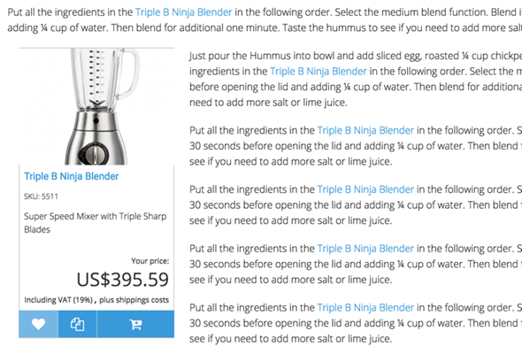
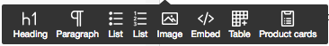
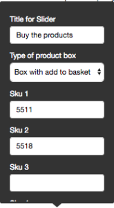
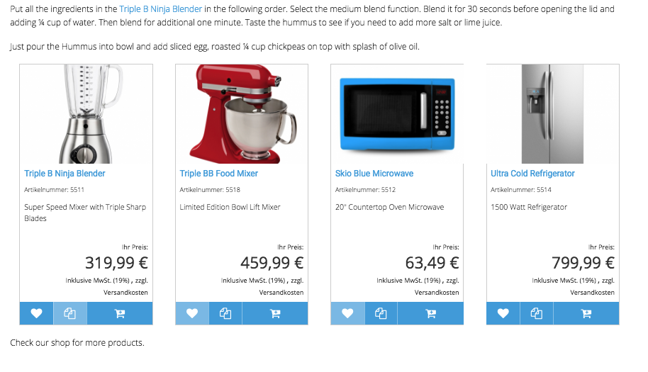
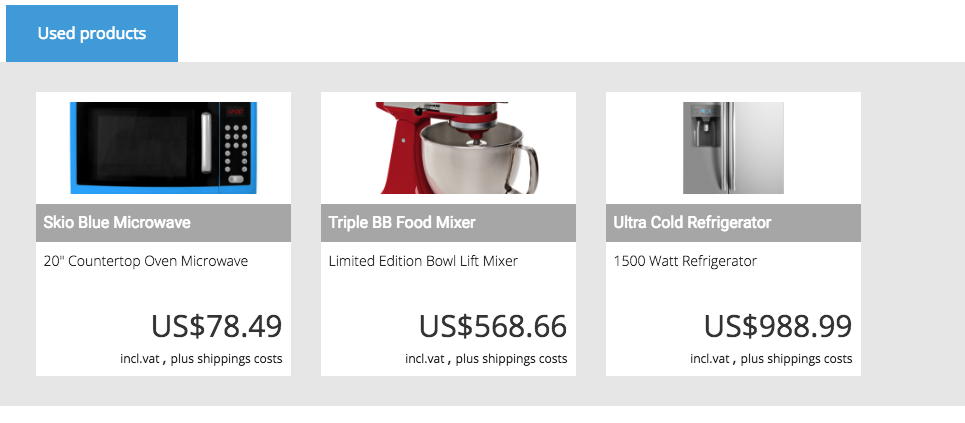

# Embed product

If you want to embed a product in a richtext field you can use the + Button and choose "Embed object".

Search for a product and select it. Afterwards you will see a product box including functions such as add to basket  and a product image. 

The text floats around the product box. This allows to place or advertise products directly in all kind of richtext fields attractively.

We recommend to use this feature if you want to place one product only. If you want to embed more than one product you can use the "product slider" feature.

## Embed a product slider 

If you want to embed more than one product inside a richtext you can choose the Product card function.

Click on the + button and choose "Product cards":

Afterwards you will see a box with some input fields:

### Title for slider

the title will be used only if you choose "Type of product box" as "Slider". It will be displayed as a tab.

### Type of Box

eZ Commerce offers 2 designs:  

**Design "Slider"**

**Design "Box with add to basket"**

### Sku 1 .. Sku 5

The skus of the products which shall be displayed
