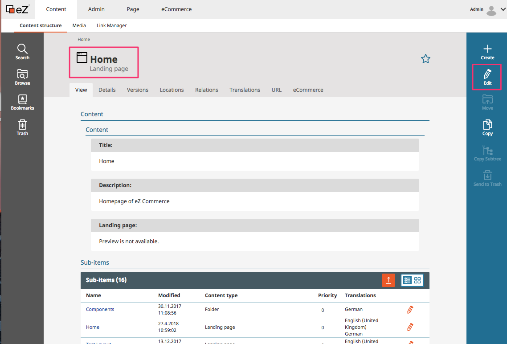
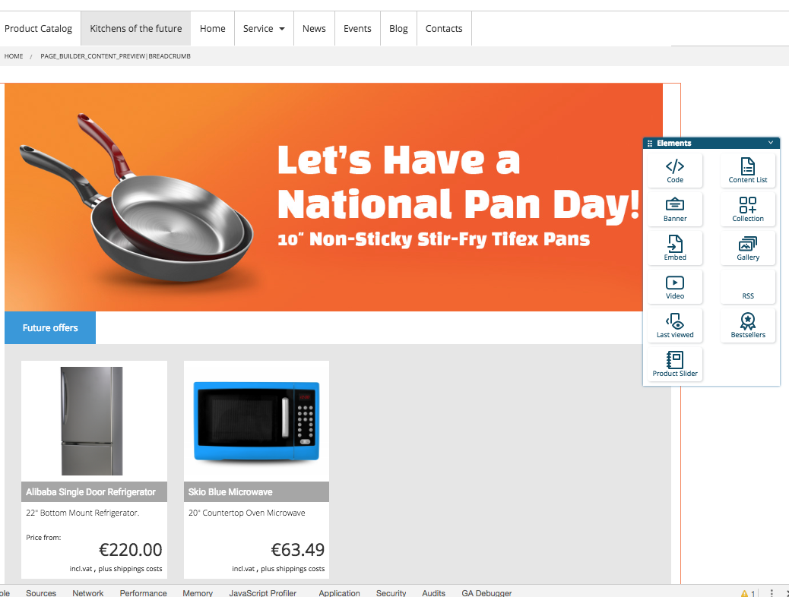

# Homepage

The homepage can be maintained and translated in the backend.

Click on "Content Structure", choose the language you want to edit and click "Edit".

You can edit the homepage using the landingpage tools. 

The home page is build using the landingpage editor. It can contain all elements described in the section [Landingpages](landingpages.md)

