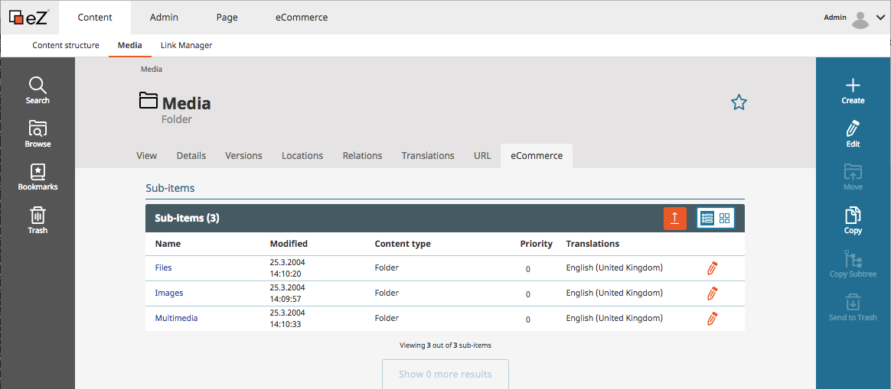

#  How to handle assets 

The integrated CMS eZ Platform offers a media database which is able to store all kind of media assets such as

  - Images
  - Videos
  - PDFs
  - other documents

The elements for the landingpages are managed in this folder.

The assets for the products are managed in the [product catalog](../shop_administration/manage_products_and_categories_with_the_ez_dataprovider.md).  
