# Landing Pages

eZ Commerce has at least one landingpage which is the homepage. This document describes how to setup and modify landingapges. 

## Landingpage tool

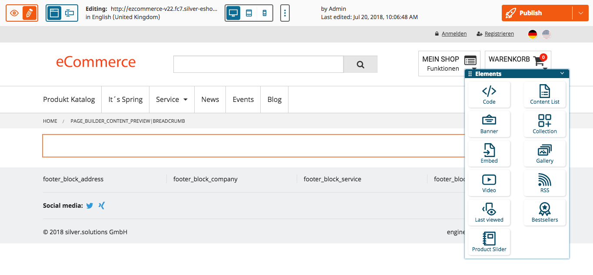

The aim of this section is to show the different content blocks you can use to create a customized landingpage. We will only describe the customized blocks that can be used in the shop. For all the other landing page blocks you can check the official eZ Platform Developer Documentation.

Available Content Blocks for landing pages:

- Code
- Content List
- Banner
- Collection
- Embed
- Gallery (customized block for the shop)
- Video
- RSS
- Last viewed (customized block for the shop)
- Bestsellers (customized block for the shop)
- Product Slider (customized block for the shop)

In the next section we describe how to use the customized landing page blocks.

## Content List

silver.eShop offers a block to show one or more documents from a given location.

This feature can be used e.g. to display a list of blog posts or events.

!!! attention

    After choosing the location you need to set the ContentTypes which shall be displayed. Example: for Blogpost you need to select "Blog post" and for Events "event".
    
    If you choose a wrong Contenttype an empty list might be displayed.

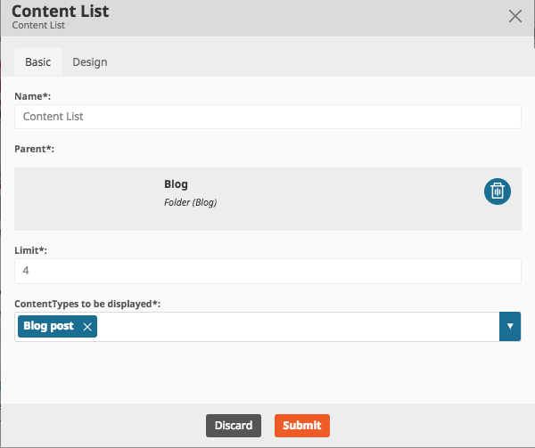

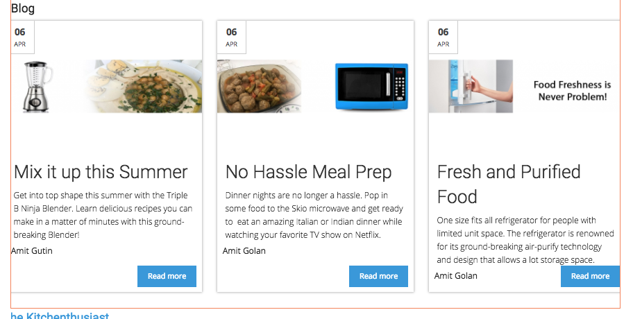

## Gallery (Slider with images)

1\. Upload images to a folder

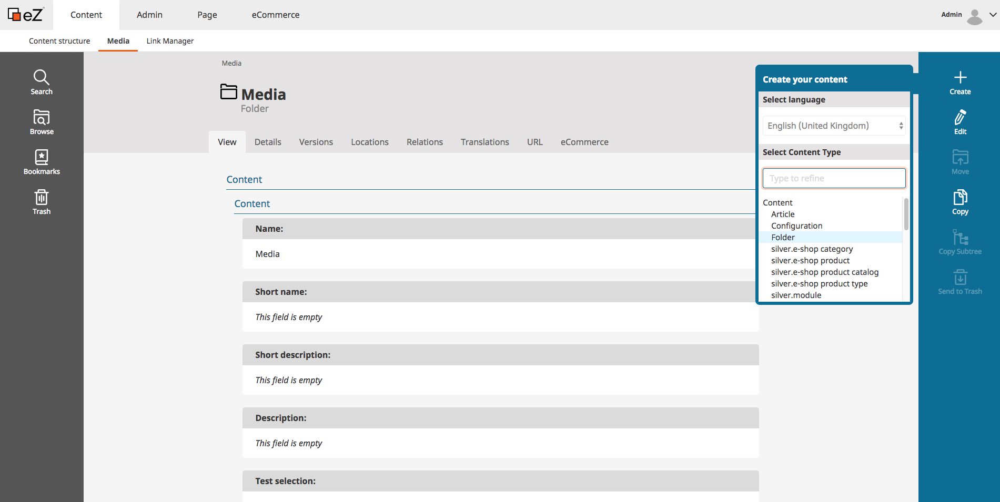

2\.

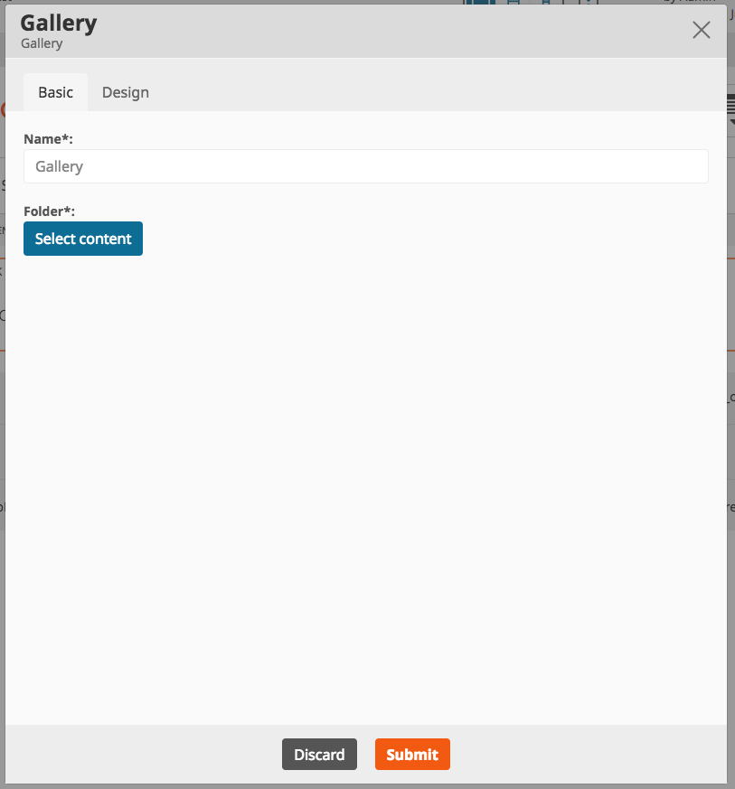

3\. Select image folder

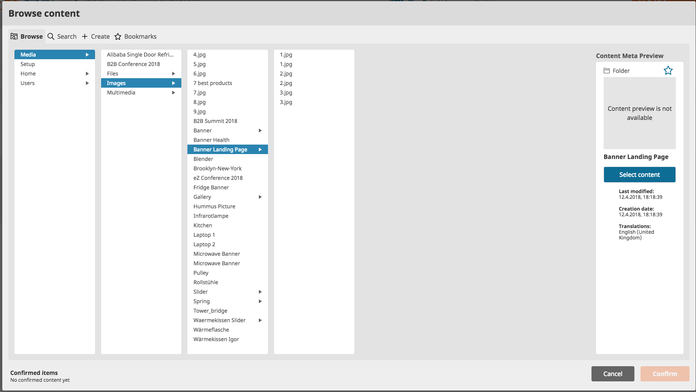

4\. Slider image preview in edit mode

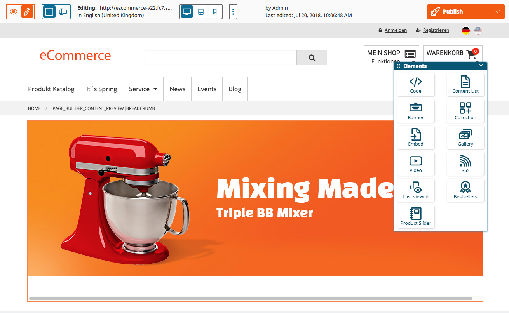

With the gallery block (customized for the shop) its possible to add a slider with several images on a landingpage:

1. Before you start you have to upload your images to a folder in the Media Libary
1. With the prepared Folder you can go to the Page Tab of the Landingpage you want to edit
1. Select the desired Folder with the images for the Slider
1. When click on Submit you will see the First image of the Slider in the preview, now you are ready to publish the landingpage

## Product Slider

1\. Add Product slider block
With the product slider block its possible to add product slider section with up to 3 different tabs.

Before adding products to the list you have to add a product slider block

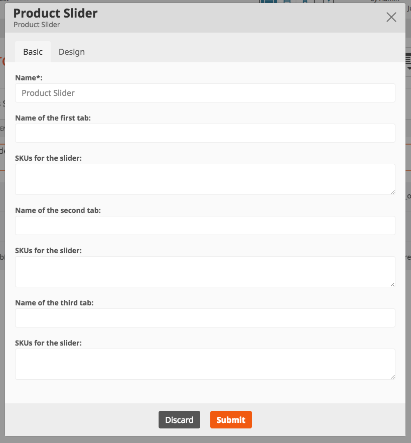

2\. Add the Tab Names and the linked products via SKU or product name.

Now you can fill in the information. Name up to 3 different tabs and fill them with the SKU`s of the products (you can search for SKUs or a product name or a leading part of a product name and can add the required products

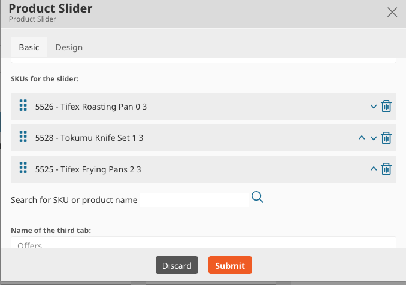

3\. Click submit and you will see a preview of the slider

Click on Submit and you will see the content of the first tab in the preview section

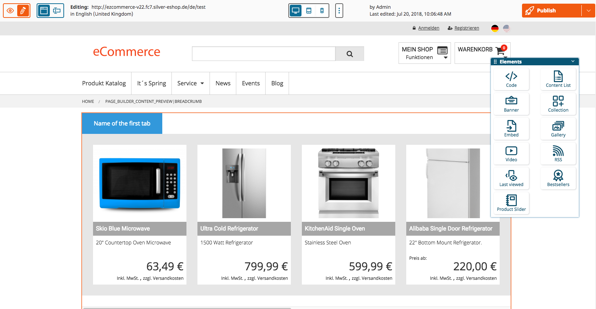

## Last viewed slider

1\. Add last viewed slider block

For the last viewed slider there is not much to say, just add the block to the desired position and you will see the last viewed products in a slider

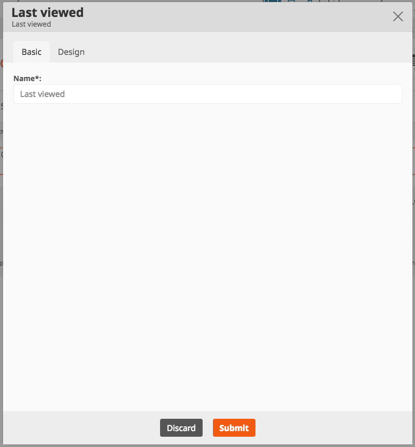

Please note that the block might not be visible in the edit mode but it will contain products in the frontend!

## Bestseller Slider

1\. Add bestseller slider block

The Bestseller block is used to show the best selled product from a chosen category. This can be the whole product catalog or a sub category.

Add a bestseller slider block to the desired position of the landing page.

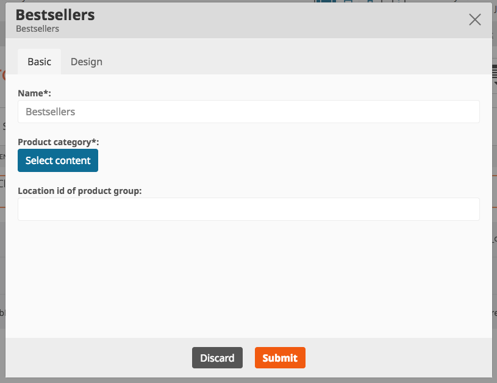

2\. Choose the category for bestsellers

Choose a category, click "Select content" and press Confirm.

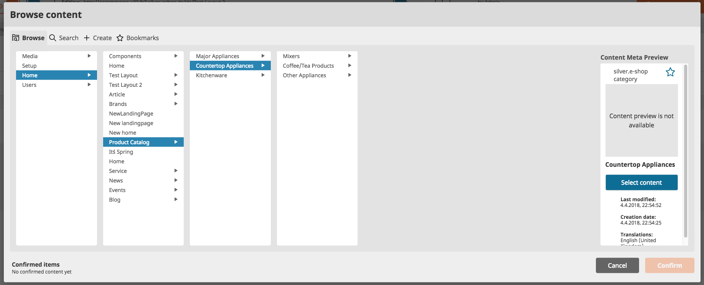

3. Click confirm and you will see a preview

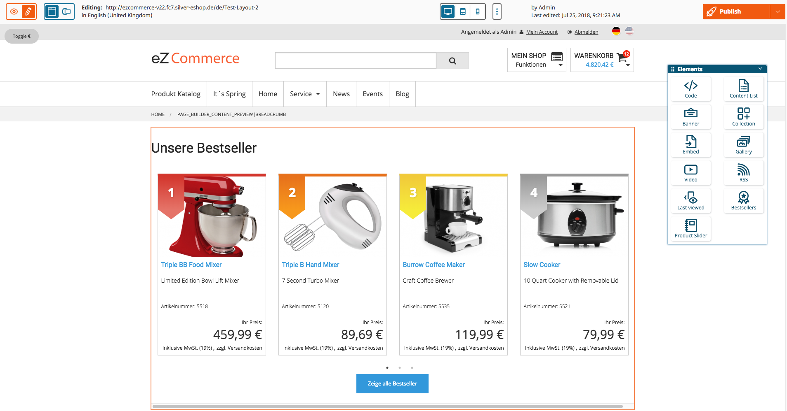
