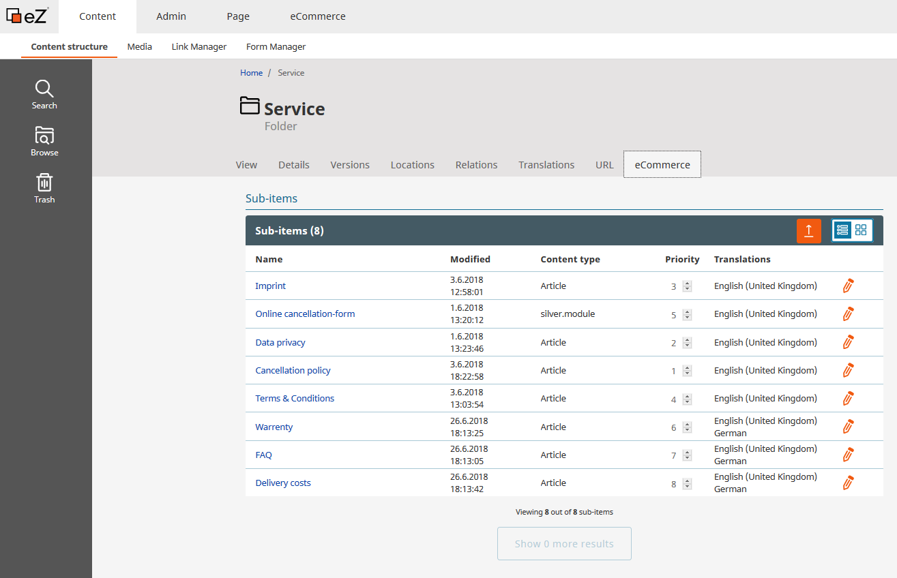
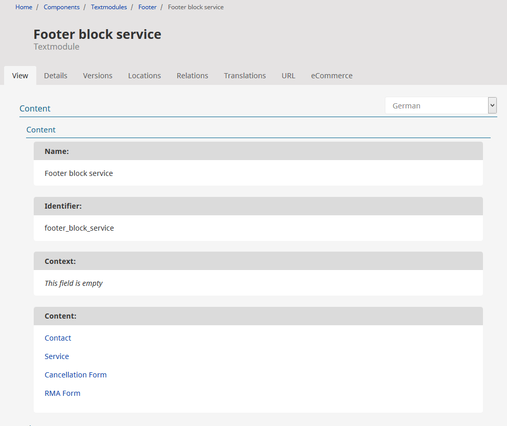
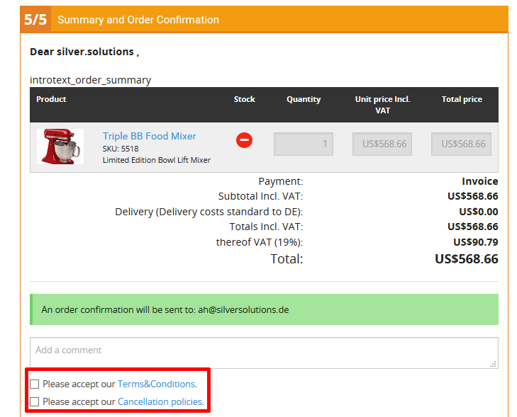
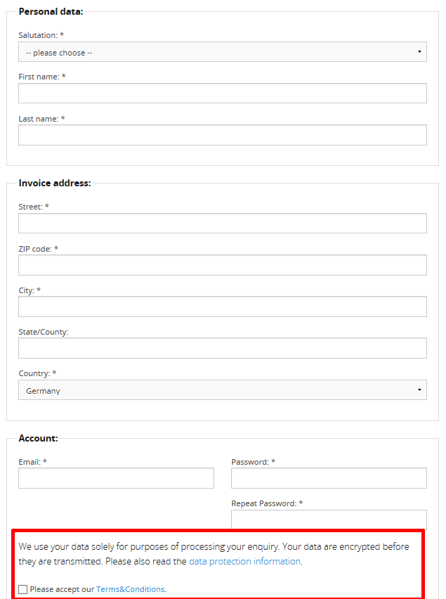
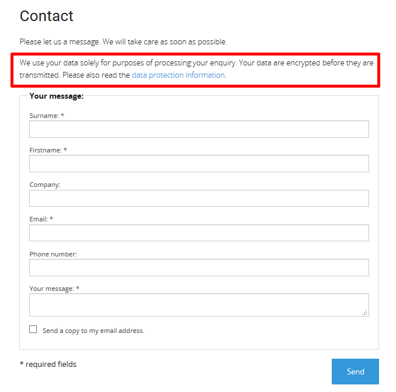
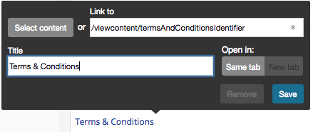
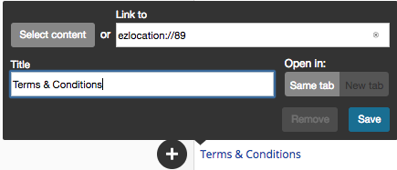

#  Legal Documents 

In an Online Shop you need a number of legal documents and forms. These can be managed in the folder "Service".

The legal documents should be linked in the Footer

The legal documents are used at various places in the shop. The T\&C is shown as an own page or as a popup during the checkout process

and in the register form.

The legal texts are linked in text modules that are used on various locations, i.e. the contact form.

The Cancellation Policy text is added to the confirmation email from the shop.

## Edit

Click on "Edit" if you want to make changes. Select the language you want to edit from the drop-down list left to the "Edit" button.

## Add identifier to "Terms & Conditions"

Add an identifier to the article. With this identifier it is possible to fetch the article and render the content using a controller.

### Controller

The article class in eZ was extended with an attribute 'identifier'. Now we can fetch the article by the given identifier and renders the content. This textmodule can be exported!

### Embed

The issue is that such a textmodules can not be e.g. imported to another DB, because they reference to eZ content with a specific node id, that might not exist or be different in the new DB.

## Add new translations

[Description how content is translated in the backend](../shop_administration/translations_for_the_shop/content_translation.md).