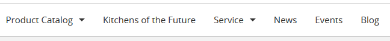
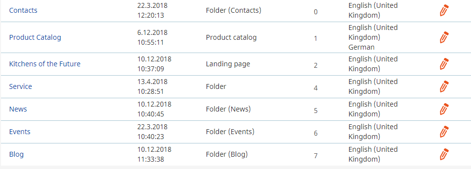

# Navigation structure

## Maintaining the navigation structure

Click on "Content" and "Content structure" tab to get to the objects displayed at the top navigation

The following object types are supported:

  - Article
  - Folder (including Folder for news, events and blog post)
  - Landing page
  - Product category
  - Product
  - Feature link

The main menu in the frontend will display elements if the Priority is higher that "0" only\! 

Elements having a low Priority (e.g. 1) are displayed first.

Please check chapter [Navigation](../../guide/navigation/navigation.md) for details.
