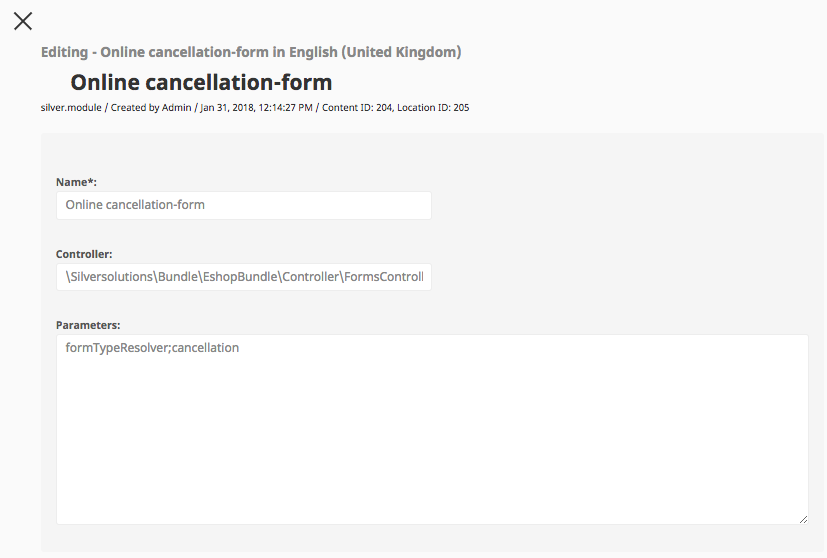

# Silver module

## Introduction

"silver.module" is a special solution provided by eZ Commerce, which allows backend users to load specific controllers (called "modules") by using eZ content itself.  

This means that when the user adds a page in the backend of type "silver.module", then this controller (provided in "Controller" field) will handle the request.

For example this allows the shop to dynamically call contact form (screenshot below).

## Configuration

 "silver.module" type has the following attributes:

|Attribute name|Description|Example value|
|--- |--- |--- |
|Name|The name of the silver.module. It is shown on the front end and is translatable.|My test module (results in an URL like: /Kontakt)|
|Controller|The controller, which should be loaded when clicking on that module. Please define the controller including the fully qualified namespace and the controller method separated by two colons (::).
The silver.module controller handler, which loads the target controller automatically validates, if the controller class and action method is available and throws an exception otherwise.|\Silversolutions\Bundle\EshopBundle\Controller\FormsController::formsAction|
|Parameters|Optional parameters (list of hashes) which is directed to the target controller. Keep in mind, that only string key-value pairs are possible.
The key value pairs are separated by a ";"|Parameter key: `formTypeResolver` Parameter value: `contact`|
