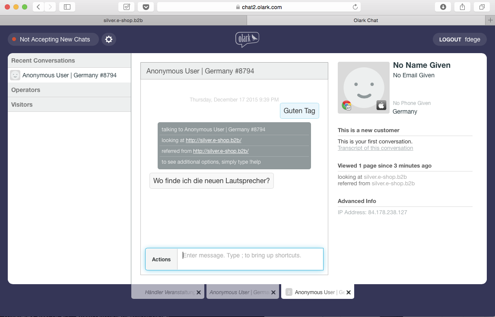
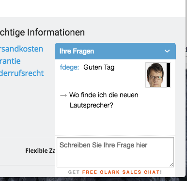
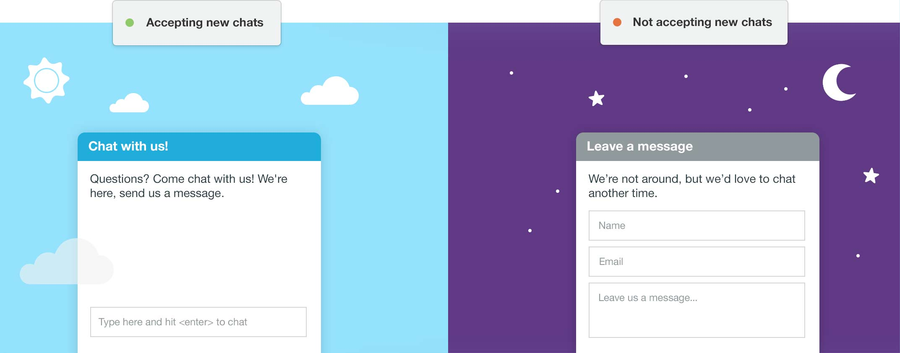
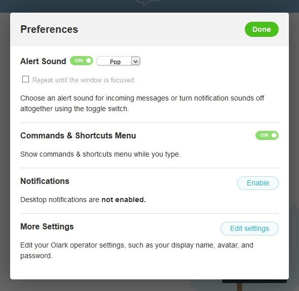
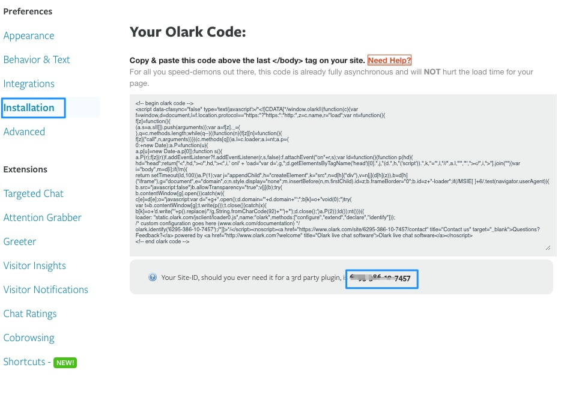

# Chat tool Olark (AddOn)

Olark is a powerful chat tool which offers more than a normal chat. A professional chat tool can improve the user experience of your shop a lot.

The shop is able to forward the name of a user (if logged in) to the service employee. Besides a chat functionality the service employee can assist the customer e.g. in pointing him to the correct place in the shop ("\!push /Produkt-Katalog/Mikrofone/URM-Serie"). 

If no support employee is available the conversion will be send by email. 

## Features

Please note that some features are available wit a special contract only. Please check the plans here: <https://www.olark.com/pricing>

<table>
<thead>
<tr class="header">
<th>Feature</th>
<th>Description</th>
<th>More infos</th>
</tr>
</thead>
<tbody>
<tr class="odd">
<td>Online/Offline</td>
<td>

The chat windows indicates whether a sales person is available or not.

If a sales person is online the chat will indicate this and it is possible to display an icon or even an image of the sales person

</td>
<td> 
</td>
</tr>
<tr class="even">
<td>Change the text inside the chat</td>
<td>
It is possible to change and translate all texts and labels used in the chat.

For each sales person an photo can be displayed
</td>
<td> 
</td>
</tr>
<tr class="odd">
<td>Special grabbers</td>
<td>Display special icons on top of the chat windows</td>
<td> 
</td>
</tr>
<tr class="even">
<td>How to use the chat for sales</td>
<td>
Olark offers a web-interface were chats can be handled

In addition local chat clients can be used as well e.g.

<ul>
<li>iChat</li>
<li>XMMP Clients</li>
<li>mobile apps</li>
</ul>

 

</td>
<td><a href="https://www.olark.com/help/clients" class="external-link">https://www.olark.com/help/clients</a></td>
</tr>
<tr class="odd">
<td>Restrict access for chat</td>
<td>
It is possible to restrict the chat tool for

<ul>
<li>specific products only</li>
<li>for a given customer or customer group</li>
<li>or from a given basked amount</li>
<li>given countries only</li>
</ul>

The chat can be displayed after a given time a user has visited a page.

 

</td>
<td> 
</td>
</tr>
<tr class="even">
<td>Information about a website user</td>
<td>
depending on your privacy rules information about a website user can be displayed in the chat such as:

<ul>
<li>Geo information</li>
<li>visited pages</li>
<li>Name and company if logged in</li>
<li>Amount of the basket</li>
<li>Customer number</li>
</ul>

 

</td>
<td> 
</td>
</tr>
<tr class="odd">
<td>Design of the chat tool</td>
<td>The design can be changed easily in the backend of Olark</td>
<td> 
</td>
</tr>
<tr class="even">
<td>Groups of sales persons</td>
<td>A chat can be assigned to a group of users as well</td>
<td> 
</td>
</tr>
<tr class="odd">
<td>Alerts and options for employees</td>
<td>

Alter can be a sound and a desktop notification. Olark can be connected to internal tools such as Jabber.

User can set his status to online / away.

</td>
<td> 
</td>
</tr>
<tr class="even">
<td>Co Browsing</td>
<td>
Olark supports Co browsing if a customer needs support.

Co browsing is supported by IE8+, Firefox, Safari, Chrome, and Opera, as well as Safari for iOS devices
</td>
<td><a href="https://www.olark.com/help/cobrowsing" class="external-link">https://www.olark.com/help/cobrowsing</a></td>
</tr>
<tr class="odd">
<td>Chat commands</td>
<td>
Olark supports a lot of hat functions. For a complete list please check the link.

Important commands:

<ul>
<li>tag - tag a chat  to label conversations </li>
<li>transfer - Transfers a conversation to another operator</li>
<li>push - Send a visitor to a different website URL</li>
<li>name - give a website user a name </li>
<li>case - Pushes the transcript for your chat into your CRM </li>
<li>send - The <code>!send</code> command allows you to forward a chat transcript via email during a chat </li>
<li>feedback - The <code>!feedback</code> command allows you to send a Chat Rating to the visitor</li>
</ul>

 

 

</td>
<td><a href="https://www.olark.com/help/commands" class="external-link">https://www.olark.com/help/commands</a></td>
</tr>
</tbody>
</table>

## Configuration

Please open an account on [www.olark.com.](http://www.olark.com.) You can choose a free version or another option as required. We recommend the payed version since it offers support features such as co browsing.

You can find the configuration in the backend of the shop. Please check the section "Customer":

Change the settings parameter:

  - Enable the service
  - Enter the Olark Account ID

You can find the Olark Account ID in the section "Installation"

After storing the configuration you will see a chat tool at the bottom of your page. 

In the settings section on [www.olark.com](http://www.olark.com) you can also configure

  - the location where the chat should appear
  - translations
  - color
  - a photo of the support employee 
  - and much more

Olark Handbook for more details [Olark handbook-en-US.pdf](/download/attachments/29819464/Olark%20handbook-en-US.pdf?version=1&modificationDate=1462950064000&api=v2)
