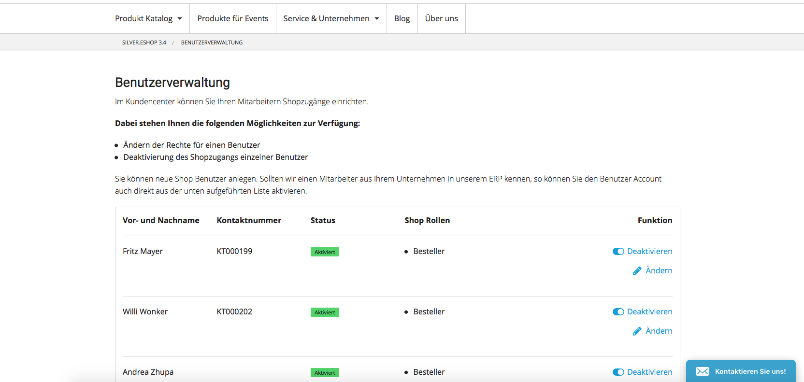
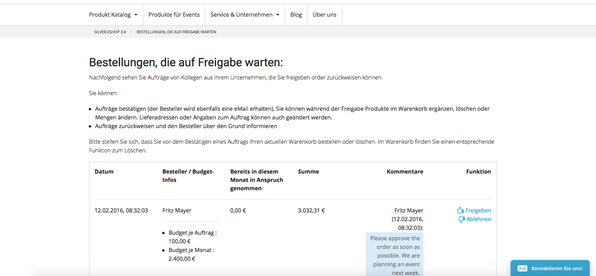

# Customer center (Plugin from 4.2) 

The extra module "Customer Center" maps customer specific business processes and makes them available in the online shop

  - User administration
  - Budget and roles\&rights management
  - Approval functions for offer requests, orders and budget

The customer center can be connected to the ERP system and synchronizes the contacts between shop and ERP system.

A customer can manage the logins, budgets and rights in the customer center panel.

A approval workflow checks the budget of the user and documents the approval process:

