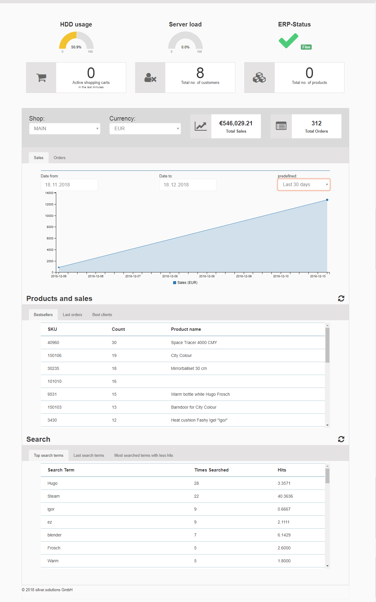
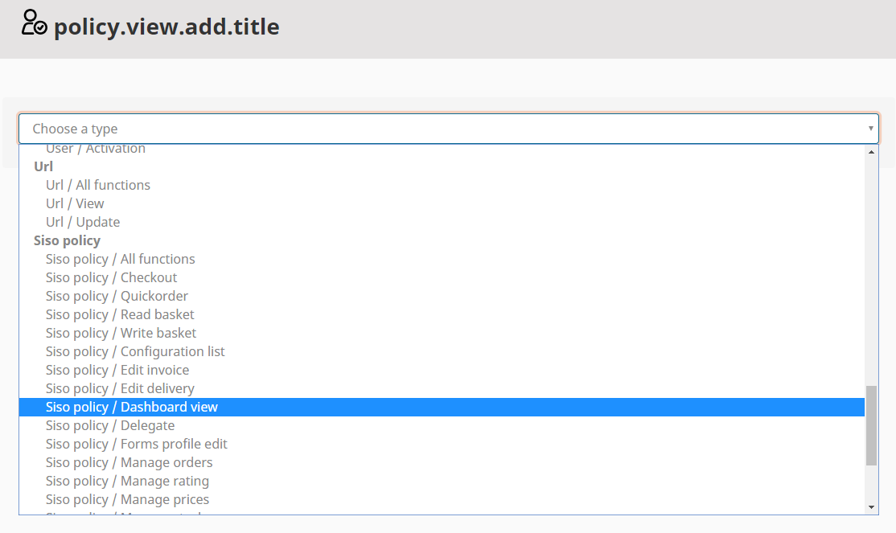
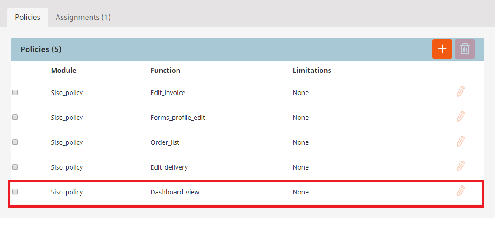

#  Cockpit 

The aim of the Cockpit is to show the most important information for the shop owner referring to the installation.

The Cockpit is divided into different sections. Here is a detailed description of each section.

## Overview

Currently, available sections:

- Technical subsection
    - HDD usage
    - Server load
    - ERP Status (Note: for eZ Commerce there would be  no information about the ERP Connection.)

- Active shopping carts (in last 30 minutes)
- Number of customers
- Number of products  (Note: the number of products only respects eZ Dataprovider. The number of products in the eContent DB is displayed in the Control Center / Manage eContent.)

Additionally this panel has an option to refresh it separately from the whole page. To refresh this panel please only use the icon in the top right corner on the section's title bar.

## Data per shop

The data in the section below refers to a specific shop. If there is more than one shop in the installation (requires additional license) the shop owner  can choose shop and currency.

Currently available data:

- Sales - shows orders value in time
- Orders - shows number of orders

To chose date range user can use date picker functionality or use list of predefined date ranges. That list contains:

- this week
- this month
- last 7 days
- last 14 days
- last 30 days

In addition there is a possibility to compare the chosen date range with the same amount of days in the past. For example if you choose last week you can compare it with the week before.

## Products and Sales

Product and sales section shows data in tables such as:

- Bestsellers (Top 20)
- Last orders (Last 365)
- Best clients (Top 20)

Additionally this panel has an option to refresh is separately from the whole page. To refresh this panel please only use the icon in the top right corner on the section's title bar.

Please notice, that the tabs:

- Last orders
- Best clients

are only visible for users, who have the policy: Siso policy / Read customers and orders ! For more information please also read the [Roles and rights section](roles_and_rights.md).

## Search

The search section offers 3 different statistics:

1\. Top search terms
The top 50 search terms were listed including how often it was searched and how many hits (average) were found.

2\. Last search terms

Lists the latest 50 search terms ordered by date.

3\. Most searched terms with less hits

- This table shows an important information since it might help to improve the search
- The searchterms which don't lead to a result will be displayed
- Times searched shows how many users have searched for it

## Roles and rights

The cockpit is accessible for users having the right to see it. This can be controlled by the role system of the CMS:

For more information please also read the [Roles and rights section](roles_and_rights.md). 

