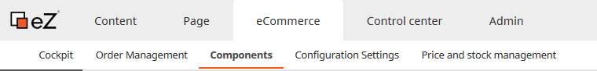
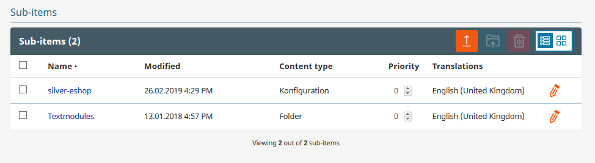

# Components

There are only two Sub-items in Components.

The eCommerce Configuration settings and Textmodules.
Please do not edit the object "silver.eShop Configuration settings" manually.
It will be updated by the changes from the configuration settings.

For the Textmodules see [Translations](translations_for_the_shop/working_with_text_modules_longer_text_elements.md).
