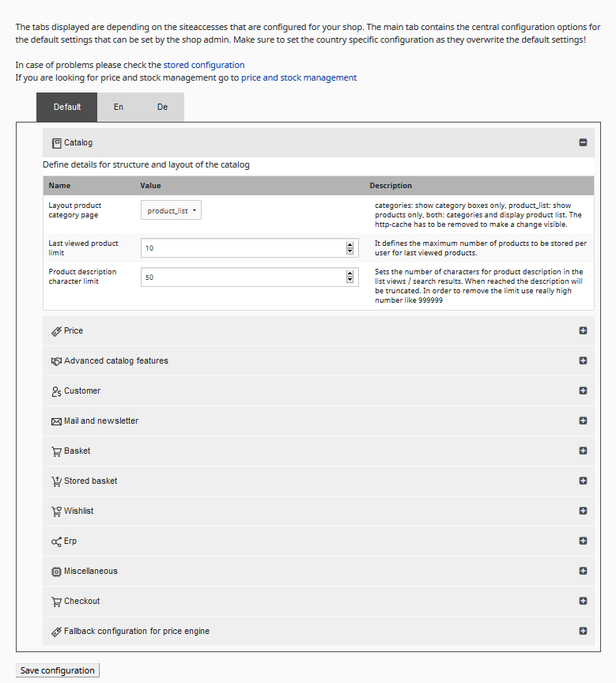
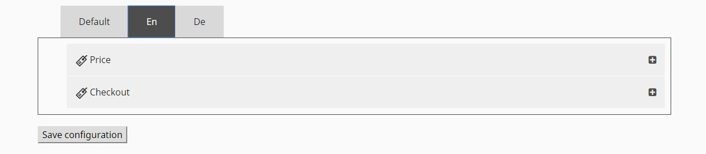

# Configuration settings

Here you can find a list of configurable settings for your shop.

In order to change the settings go to eZ Commerce in the top menu → eCommerce-\>Configuration settings.

For additional configuration settings use yml files to add the required settings.

Configuration is divided into tabs. Each tab contains multiple sections that offer specific settings. 

**Important: Please note that settings defined in the backend will always override a configuration which is defined in Yaml files!**

## Catalog

The catalog section defines details for structure and layout of the catalog.

|Name|Stored Configuration File|Default|Description|
|--- |--- |--- |--- |
|Layout product category page|siso_core.default.category_view: product_list|product_list|This setting changes the layout for the product category page. category: - show category boxes only product_list: - show products only both: - first categories are show afterwards products are displayed Note! The http-cache has to be emptied to make a change visible!|
|Last viewed product limit|silver_eshop.default.last_viewed_products_in_session_limit: 10|10|It defines the maximum number of products to be stored per user for last viewed products.|
|Product description character limit|silver_eshop.default.catalog_description_limit: 50|50|Sets the number of characters for product description in the list views / search results. When reached the description will be truncated. In order to remove the limit use really high number like 999999|

## Price

Configure currencies and set price provider for the shop. Advanced version only Some configurations are only possible and important for eZ Commerce Advanced. The price provider `siso_price.price_provider.remote` is offered by Advanced version only.

The possibility to manage the source of prices for different situations in the shop  (remote price provider (=from ERP) and shop price provider) is heplful for performance reasons.  

|Name|Stored Configuration File|Default|Description|
|--- |--- |--- |--- |
|Last currency rate change||empty|The value (date) describes, when the conversion rate has changed the last time.|
|Automatic currency conversion||False|In case no price is setup for this currency the shop can calculate the price using a conversion rate from the configuration.|
|Currency conversion rate|||Define the conversion rate between currencies here.|
|Default currency|siso_core.default.standard_price_factory.fallback_currency: EUR|EUR|Used as currency for the shop (e.g. per siteaccess)|
|Base currency|siso_core.default.standard_price_factory.base_currency: EUR|EUR|Base currency of the shop in general (is used for the fields "product unit price" and "fallback shipping price". The base currency will be used for the automatic currency conversion)|
|Price providers for product listing page|siso_price.default.price_service_chain.product_list: - siso_price.price_provider.shop - siso_price.price_provider.remote|shop|Advanced version only Please choose which price calculation engines shall be used for generating prices and stock information. siso_price.price_provider.shop means price engine in the shop is used for price calculation. Advanced version only siso_price.price_provider.remote means ERP is used for price calculation. This configuration works as a chain, so if the first engine fails the second one will be used as a fallback (e.g. in case the ERP is not availbale) Important note: Price calculations in ERP systems may cause slower responses from the system, depending on the specific complexity.|
|Price providers for product detail page|siso_price.default.price_service_chain.product_detail: - siso_price.price_provider.shop - siso_price.price_provider.remote|shop|Choose shop or remote|
|Price providers for product sliders|siso_price.default.price_service_chain.slider.product_detail: - siso_price.price_provider.shop - siso_price.price_provider.remote|shop|Choose shop or remote|
|Price providers for basket|siso_price.default.price_service_chain.basket: - siso_price.price_provider.shop - siso_price.price_provider.remote|shop|Choose shop or remote|
|Price providers for editing variants|siso_price.default.price_service_chain.basket_variant: - siso_price.price_provider.shop - siso_price.price_provider.remote|shop|Choose shop or remote|
|Price providers for stored baskets lists|siso_price.default.price_service_chain.stored_basket: - siso_price.price_provider.remote - siso_price.price_provider.shop|shop|Choose shop or remote|
|Price providers for whishlist|siso_price.default.price_service_chain.wish_list: - siso_price.price_provider.shop - siso_price.price_provider.remote|shop|Choose shop or remote|
|Price providers for quickorder (click on update)|siso_price.default.price_service_chain.quick_order: - siso_price.price_provider.shop - siso_price.price_provider.remote|shop|Choose shop or remote|
|Price providers for quickorder (product preview via Ajax)|siso_price.default.price_service_chain.quick_order_line_preview: - siso_price.price_provider.shop - siso_price.price_provider.remote|shop|Choose shop or remote|
|Price providers for comparison lists|siso_price.default.price_service_chain.comparison: - siso_price.price_provider.remote - siso_price.price_provider.shop|shop|Choose shop or remote|
|Price providers for search lists|siso_price.default.price_service_chain.search_list: - siso_price.price_provider.remote - siso_price.price_provider.shop|shop|Choose shop or remote|
|Price provider for bestseller list|siso_price.default.price_service_chain.bestseller_list: - siso_price.price_provider.shop - siso_price.price_provider.remote|shop|Choose shop or remote|

## Customer

**Note:** Olark chat tool requires an account with this third party provider.

|Name|Stored Configuration File|Default|Description|
|--- |--- |--- |--- |
|Enable Olark Chat|siso_core.default.marketing.olark_chat.activated: false|True|Olark chat is a powerful chat tool. Please check <www.olark.com> for more information.|
|Please enter the Account ID from <www.olark.com> here|siso_core.default.marketing.olark_chat.id: '6295-386-10-7457'||Olark account id|

## Advanced Catalog Features 

Choose advanced shop feature settings

|Name|Stored Configuration File|Default|Description|
|--- |--- |--- |--- |
|Disable ordering for discontinued products|siso_basket.default.discontinued_products_listener_active: true|True|If enabled products which are discontinued and out of stock cannot be ordered any more.|
|Check packaging units and adjust quantity of discontinued products|siso_basket.default.discontinued_products_listener_consider_packaging_unit: true|True|If enabled the shop will modify the quantity of discontinued products ordered by a user automatically to the next packaging unit.|

## Mail and Newsletter

**Note:** Newsletter2go requires the activation of a seperate plugin and an account with Newsletter2go.

|Name|Stored Configuration File|Default|Description|
|--- |--- |--- |--- |
|Email address of a sales person|siso_eshop.default.orderconfirmation_sales_email_address:||This person will get an CC of an order confirmation email (for all orders generated in the shop)|
|**Newsletter**||||
|Activate Newsletter2go|siso_newsletter.default.newsletter_active: false|False|You need to create an account on www.newsletter2go.com|
|Unsubscribe from all newsletters|siso_newsletter.default.unsubscribe_globally: true|True|Unsubscribe options. If true shop users can unsubscribed from all newsletters in one step.|
|Newsletter only for logged in users|siso_newsletter.default.display_newsletter_box_for_logged_in_users: true|True|If enabled only logged in users will see the newsletter box.|
|Newsletter2go username|siso_newsletter.default.newsletter2go_username: ''|-|See newsletter2go account|
|Newsletter2go password|siso_newsletter.default.newsletter2go_password: ''|-|See newsletter2go account|
|Newsletter2go authentication key|siso_newsletter.default.newsletter2go_auth_key: ''|-|This key is available in your newsletter2go account|

## Basket

Defines detailed behaviour for the basket.

|Name|Stored Configuration File|Default|Description|
|--- |--- |--- |--- |
|Duration of storing anonymous baskets|ses_basket.default.validHours: 120|120|Defines how many hours anonymous baskets are stored.|
|Update product data after this time|ses_basket.default.refreshCatalogElementAfter: '1 hours'|1 hours|Product data is cached in the basket for a given time. Please use a syntax "1 hour".|
|Display stock as a column|ses_basket.default.stock_in_column: true|True|True - display in column, False - display inline (in product name column).|
|Description character limit|ses_basket.default.description_limit: 50|50|Number of characters that will be visible for the description field.|
|Enable additional comment line for basket|ses_basket.default.additional_text_for_basket_line: false|False|If enabled the customer can enter a comment to each line in the basket or quickorder.|
|Max. chars for the additional comment line|ses_basket.default.additional_text_for_basket_line_input_limit: 30|30|Advanced version only. Important note: the ERP often has a restriction and might not support long comments. This might lead to errors during order process|

## Stored basket

Configures the displayed product data for stored baskets.

|Name|Stored Configuration File|Default|Description|
|--- |--- |--- |--- |
|Display stock as a column|ses_stored_basket.default.stock_in_column: true|True|True - display in column, False - display inline (inside product name column).|
|Description character limit|ses_stored_basket.default.description_limit: 50|50|Number of characters that will be visible for the description field.|

## Wishlist

|Name|Stored Configuration File|Default|Description|
|--- |--- |--- |--- |
|Description character limit|ses_wishlist.default.description_limit: 50|50|Number of characters that will be visible for the description field|

## ERP (only if shop is connected to ERP)

Defines the details of data exchange and processes between your shop and your ERP.  ERP integration requires a web.connector licence or another webservice interface between ERP and Shop.

|Name|Stored Configuration File|Default|Description|
|--- |--- |--- |--- |
|Default Country for Template Debitor|siso_core.default.template_debitor_country: DE|DE|Determines which country shall be used as a default. Please use the country code such as "DE" for Germany.|
|Login with Customer Number|siso_core.default.enable_customer_number_login: false|False|This true:false value determines, if the login process should include a field for providing customer number.|
|Use a template debitor number for this shop|siso_core.default.use_template_debitor_customer_number: true|True|A template debitor customer number is used, if a customer does not have a customer number from the ERP. The template debitor customer numbers can be defined for each country.|
|Use a template contact number for this shop|siso_core.default.use_template_debitor_contact_number: true|True|A template contact number is used if a customer does not have a customer and contact number from the ERP. The template contact numbers can be defined for each country|
|price_requests_without_customer_number/config|siso_core.default.price_requests_without_customer_number: true|True|This true:false value determines, if a price request will be sent to the ERP without customer number. A template debitor will be used to calculate prices.|
|Recalculate prices using the ERP after|ses_basket.default.recalculatePricesAfter: '3 hours'|True|Information from the ERP is cached in order to reduce the traffic towards the ERP. Please use a syntax "1 hour".|
|Variants handling in the ERP|silver_eshop.default.erp.variant_handling: SKU_ONLY|SKU_ONLY|Choose which handling of variant products should be taken. SKU_ONLY - if your ERP system uses different SKUs per variant. SKU_AND_VARIANT - if your ERP system uses a combination of SKU and variant code for variants.|
|URL of the Web-Connector|siso_erp.default.web_connector.service_location:|-|The URL points to your Web-Connector System installed near by your ERP system. Please use a https connection and make sure that the shop can access this ip and port only!|
|User name (configured per Web-Connector)|silver_eshop.default.webconnector.username: admin|admin|User name for the communication with the Web-Connector service|
|Password (configured per Web-Connector)|silver_eshop.default.webconnector.password: passwo|passwo|Password for the communication with the Web-Connector service|
|SOAP Web-Service timeout in seconds|silver_eshop.default.webconnector.soapTimeout: 5|5|Timeout (Web-Service) for the communication with the Web-Connector in seconds|
|Timeout towards the ERP-System in seconds|silver_eshop.default.webconnector.erpTimeout: 5|5|Timeout (ERP) for the communication with the Web-Connector in seconds|

## Miscellaneous

Define settings for additional features

|Name|Stored Configuration File|Default|Description|
|--- |--- |--- |--- |
|Number of bestsellers displayed on bestseller page|siso_core.default.bestseller_limit_on_bestseller_page: 6|6|Choose the limit of bestsellers that should be displayed.|
|Number of bestsellers displayed on catalog pages|siso_core.default.bestseller_limit_on_catalog_page: 6|6|Choose the limit of bestsellers that should be displayed.|
|Number of bestsellers displayed in a slider|siso_core.default.bestseller_limit_in_silver_module: 6|6|Choose the limit of bestsellers that should be displayed.|
|Threshold bestseller|siso_core.default.bestseller_threshold: 1|1|How often has a product to be bought, to count as a bestseller?|

## Checkout

Configure your payment and shipping methods. Paypal requires an account.

|Name|Stored Configuration File|Default|Description|
|--- |--- |--- |--- |
|Payment method "PayPal"|siso_checkout.default.payment_method.paypal_express_checkout: true|True|Enables "PayPal" in checkout|
|Payment method "invoice"|siso_checkout.default.payment_method.invoice: true|True|Enables "invoice" in checkout|
|Shipping method "standard"|siso_checkout.default.shipping_method.standard: true|True|Enables shipping method "standard" in checkout|
|Shipping method "express"|siso_checkout.default.shipping_method.express_delivery: true|True|Enables shipping method "express" in checkout|

## Fallback configuration for price engine

Fallback configuration for price engine. It is used, if no shipping costs are set in [price and stock management](manage_prices_and_stock.md).

|Name|Stored Configuration File|Default|Description|
|--- |--- |--- |--- |
|Fallback costs for shipping|siso_local_order_management.default.shipping_cost: ''|-|Shipping cost for shop in shop currency if shipping free limit is not reached|
|No shipping costs for orders from amount|siso_local_order_management.default.shipping_free: ''|-|Shipping free limit for shop in shop currency|
|Fallback VAT Code for shipping costs|siso_core.default.shipping_vat_code: '19'|19|Used for calculating the VAT part for shipping|

## Configuration for countries/site accesses

For some settings the shop requires a country specific configuration.

## Price

Configure currencies and set price provider for the shop.  

|Name|Stored Configuration File|Default|Description|
|--- |--- |--- |--- |
|Default currency|siso_core.en.standard_price_factory.fallback_currency: USD|USD|This currency is used as fallback currency, if the siteaccess specific configuration is not configured (e.g. per siteaccess)|

## Checkout

Configure your payment and shipping methods. Paypal requires an account.

|Name|Stored Configuration File|Default|Description|
|--- |--- |--- |--- |
|Payment method "PayPal"|siso_checkout.en.payment_method.paypal_express_checkout: true|True|Enables "PayPal" in checkout|
|Payment method "invoice"|siso_checkout.en.payment_method.invoice: true|True|Enables "invoice" in checkout|
|Shipping method "standard"|siso_checkout.default.en.shipping_method.standard: true|True|Enables shipping method "standard" in checkout|
|Shipping method "express"|siso_checkout.default.en.shipping_method.express_delivery: true|True|Enables shipping method "express" in checkout|
