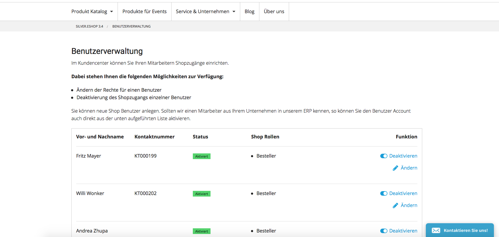
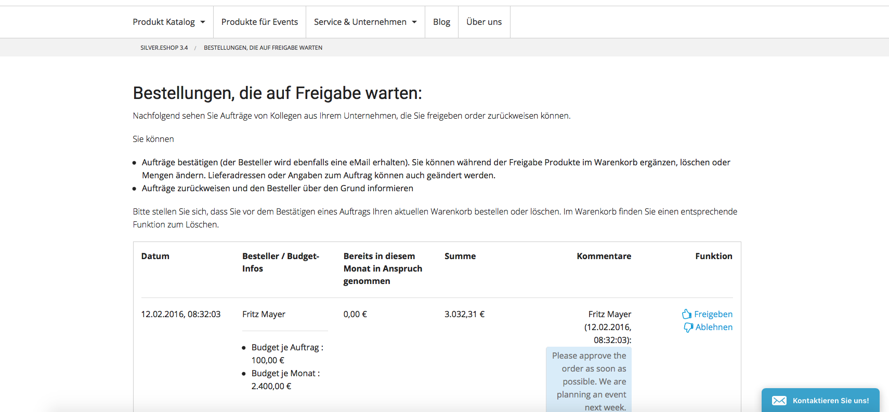

# Customer center

Customer center enables user administration, budget and permission management and approval functions for orders.

The customer center can be connected to the ERP system and synchronize the contacts between shop and ERP system.

A customer can manage the logins, budgets and permissions in the customer center panel.

An approval workflow checks the budget of the user and documents the approval process:

