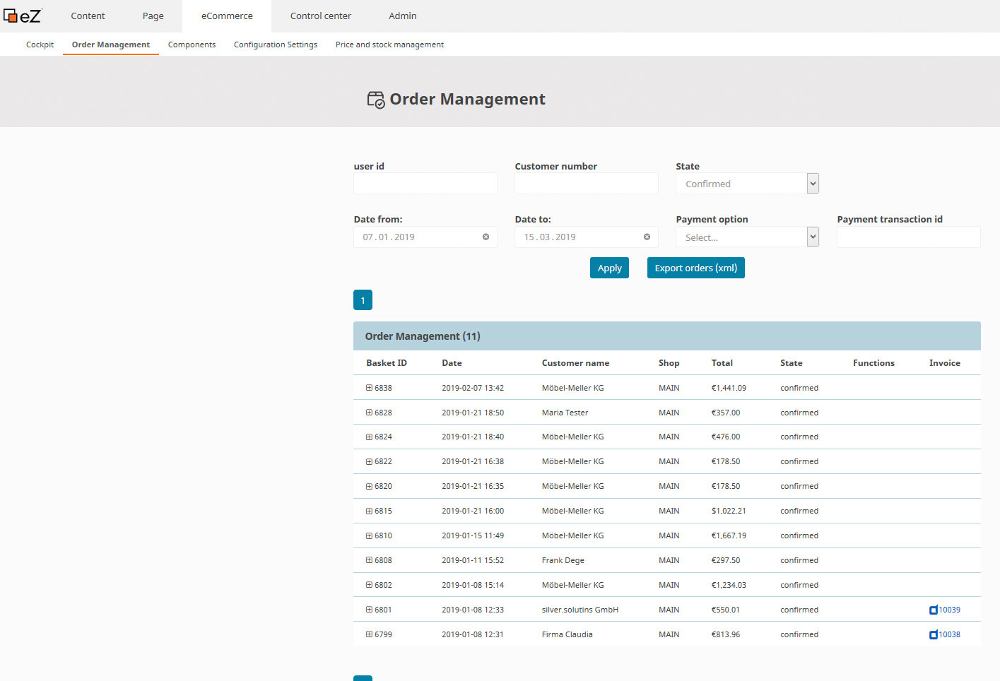
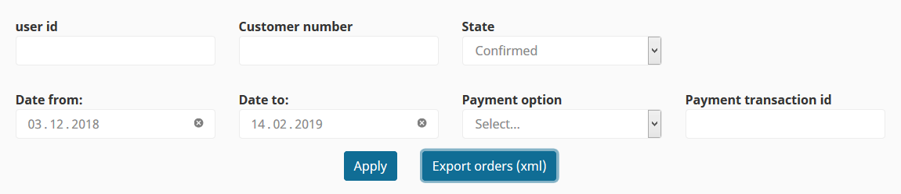
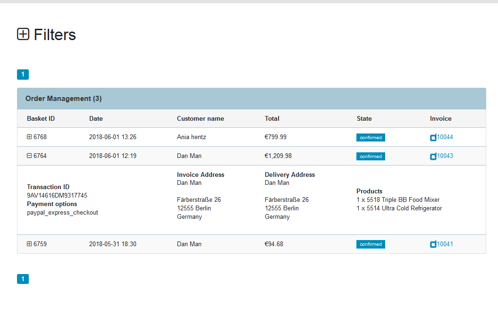
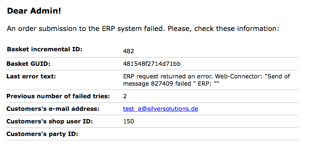
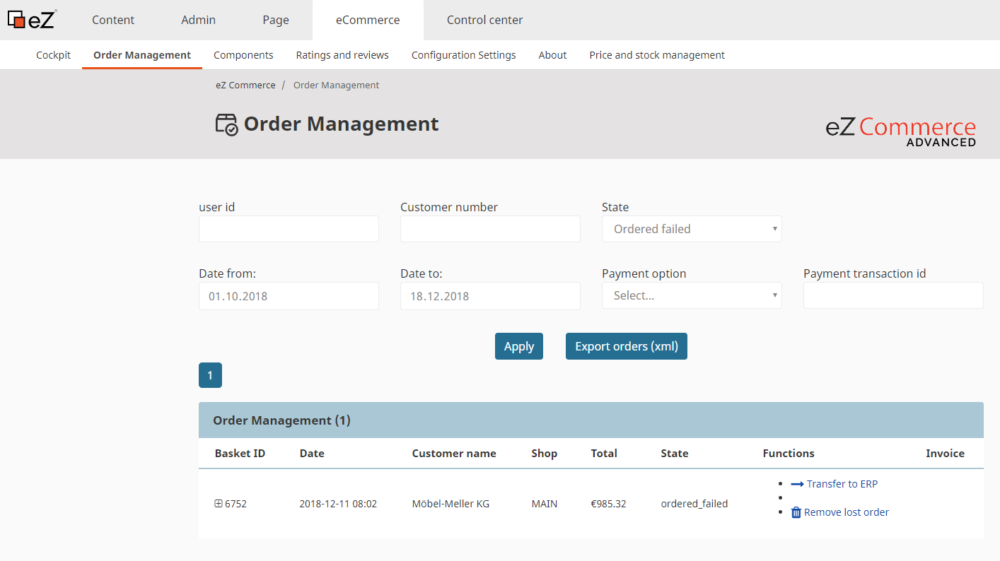
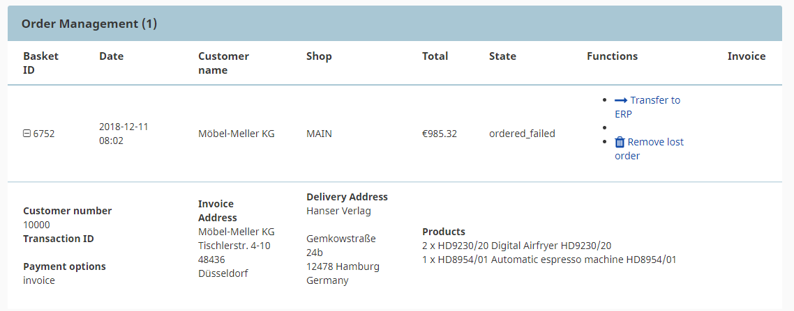

# Manage orders

## Order management

eZ Commerce provides a list of all orders in the backend: eZ Commerce -\> Order Management

The shop owner can check, filter and export all the orders that were processed in the shop. Additionally he can see the invoice that was automatically generated by the shop for the order (if no ERP is connected).

### Filters offered 

There are different filters to make it easier: 

- Filter by **user ID**
- Filter by **Customer number**
- Filter by **date** : Possibility to filter by a period of time. By default it is set the period between the current date and one month in the past.
- Filter by **State**: Select box with different states:
    - Confirmed
    - Payed
    - Advanced version only
        - Order failed - the order failed to be transferred to the ERP, the shop will retry to send it   
        - New - Baskets which are not yet sent  
        - Offered - Baskets in the payment process
        - Approval - Orders using an approval workflow (Module Customer Center)
        - Rejected - Orders refused by the approver (Module Customer Center)  
- Filter by **Payment option**: Select box with different payment options (The list has to be configured in the section "Configuration settings" under "Checkout". 
    - Paypal\_express\_checkout
    - Invoice
- Filter by **Payment transaction id.**

### The list of orders 

Fields that are displayed in the table.

- **Basket ID:** Id of the basket stored in the database.
- **Date:** Date and time this basket has last been modified
- Customer name: Name des Kunden
- **Total:**  Total amount from the basket including VAT and shipping costs
- **State:** state of the basket.
- **Invoice**
- Click on the plus icon to see the following information:  
  - **Transaction ID:** If the order has been payed using an electronic payment the transactioncode will be displayed
  - **Payment options:** It will show the chosen payment option
  - **Invoice Adress**
  - **Delivery Adress**
  - **Products:** List of products (SKU) and the quantity

## With ERP connection only  
  
When an ERP system is used the orders will be transferred to the ERP. When an ERP is connected the shop does not create invoices, so no invoice will be available in the order management. Nevertheless the online orders can be checked in this section. 

In addition there is one important service functionality - the Lost Orders.

### Lost orders 

**What happens when an order cannot be transferred to the ERP**

Since the ERP system might not be up and running eZ Commerce is able to store the orders and retransmit orders when the ERP is working.  The orders are stored in a database table and marked for retransmission. The shop records the number of retries. By default the maximum number is 3 (siso\_checkout.default.max\_failed\_order).

The shop will send an email to the shop administrator describing details about the order:

**Reason why an order could not be sent to the ERP**

There may be a lot of reasons for why an order has not been send to the ERP system. It depends on the ERP system if an approbate error message can be provided.

The error message varies as well. Some examples:

|Reason|Details|
|--- |--- |
|ERP offline||
|Connection from shop to ERP is not working|In this case a message such as "Cannot connect to host" Send of message XXXXX failed (Navision) may be documented.|
|Customer blocked||
|Credit limit reached||
|Invalid fields in the order|The shops send e.g. a country code which isn´t setup in the ERP.|
|Invalid SKU|This might happen if a sku has been imported which is remove in the ERP system|

**Manage lost orders**

eZ Commerce provides a list oder lost orders in the backend of the shop.  

Use the filter "State: Order failed" to see the lost orders.

Overview:  

  

**Customer number:** It gets the customer number from the basket ("basket.buyerParty.PartyIdentification\[0\].ID")

**Shop:** It shows which shop has been used by the customer (used for multishops only)

**Functions:** It shows a link toremove or to transfer the order to ERP if the order is a lost order

**How transfer orders again**

Please choose an order which shall be transfered and click on "Transfer to ERP". The order will be send to the ERP and after a few seconds you will see an message:

Details of a Lost Order:  
  

|No|Line|Description|
|--- |--- |--- |
|1|Customer No||
|2|Transaction ID|if payment provider was involved|
|3|Payment|Chosen payment method|
|4|Invoice address||
|5|Delivery address||
|6|Products|Quantity and SKUs|
