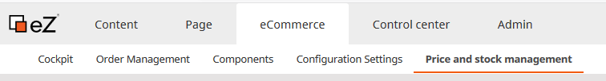
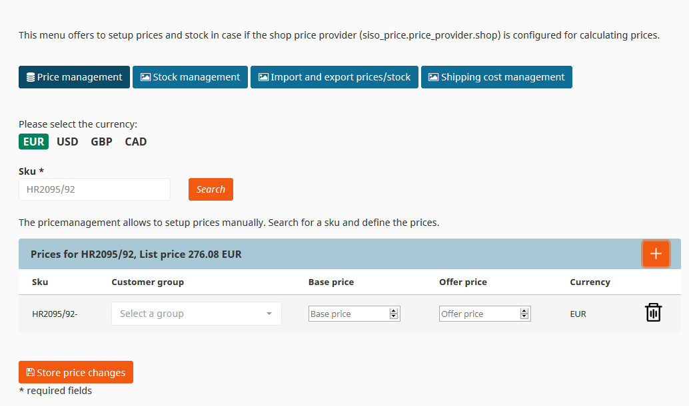
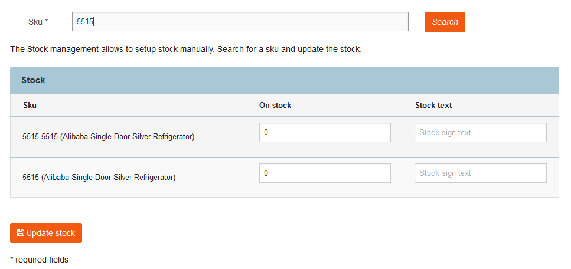
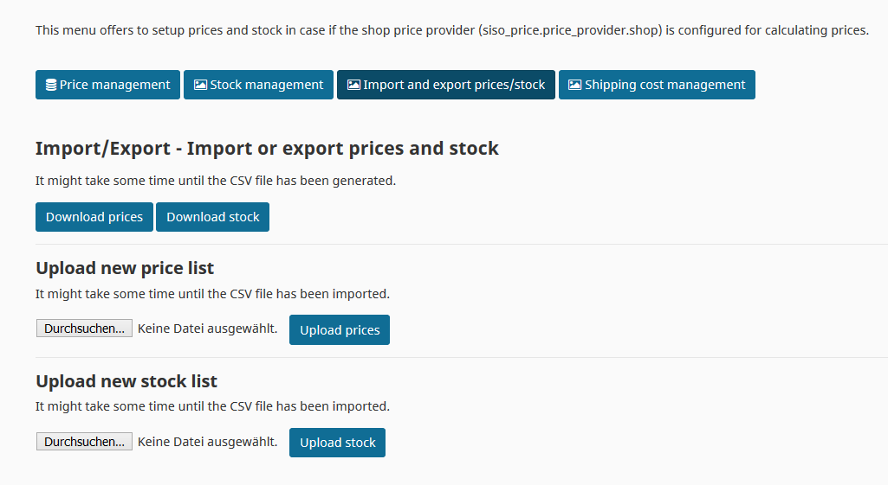
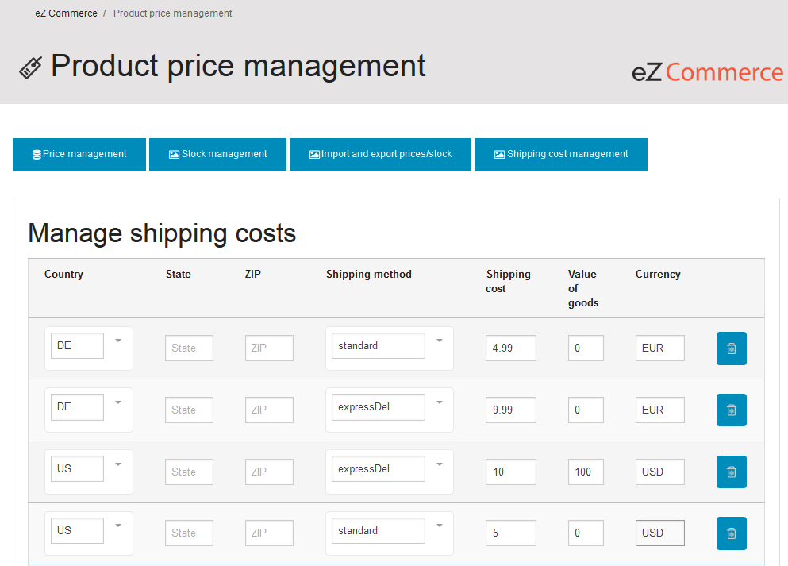

#  Manage prices and stock 

## Product prices

This feature offers to setup prices in case if the shop price provider (siso_price.price_provider.shop) is configured for calculating prices.

The price management allows to setup prices manually. A price can be setup per sku and sku/variant. Each price can contain an offer

price and a base price. If an offer price is set it will be displayed in the shop as

~~Old price: 10.00 €~~ New price: 9.80 €

In addition prices can vary per customer group. There are 3 customer goups set up per default.

Currencies in eZ Commerce:

The currency is configured per country in the [configuration settings](../../product_description/ecommerce_administration.md).

- if a product has a price for a product and a currency this price will be displayed in the shop
- if no price for a currency is set in a shop eZ Commerce offers 2 options, these can be set in the configuration per shop.
    - Calculate the price for the requested currency using the base price defined in the product (using the base currency setup for the installation) and an exchange rate defined in the configuration
    - Display an error in the frontend that no price is available
    
## Product - stock

This menu offers to setup stock in case if the shop price provider (siso_price.price_provider.shop) is configured for calculating prices.

## Product - prices

This feature allows to update stock and prices using a csv file. Prices and stock can be downloaded and uploaded in case if the shop price provider (siso_price.price_provider.shop) is configured for calculating prices.

## Shipping costs

Shipping cost management offers to setup shipping cost rules. Shipping rules can be mangaged per delivery country, state, zip and shipping method.

In addition it is possible to configure different shipping cost depending on the amount of the basket (including free of freight rules)

## 