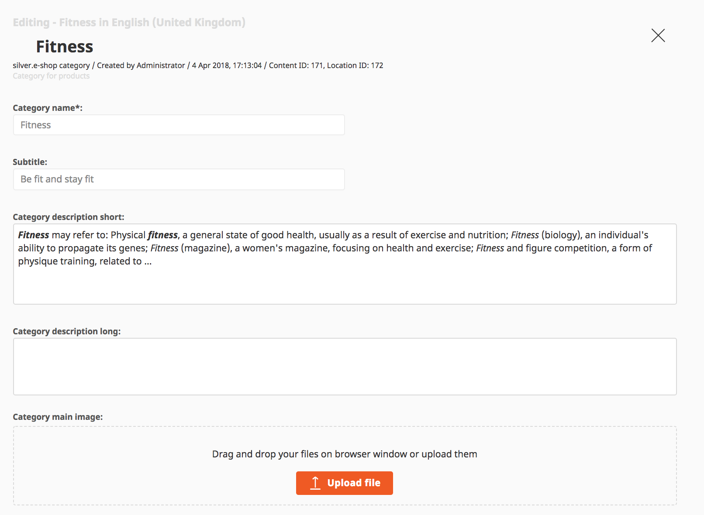

#  Manage products and categories with the eZ dataprovider 

## Manage categories

The product catalog is fully integrated into the content tree of the CMS. The products are managed as eZ objects.

Products and categories can be assigned to the product catalog.

## Flexible categories

A category contains a standard set of fields. A category is a CMS content type and can be extended with additional fields by the eZ Partner.

## Product - product texts

eZ Commerce offers a set of product fields. Since a product is build using the flexible eZ content type system it can be extended with new fields easiliy.

While editing a product the preview will now display exactly how the product will look on desktops or mobile devices including product variants.

This simplifies the work of a shop owner since he can see how a complex product would look before it is published in the shop.

## Product - flexible attribute system

The attribute system allows to manage product attributes in a fast and flexible way.

Attributes can be setup using a template system (shared attributes) or extended with product specific attributes.

The attributes can be grouped.

Product attributes are indexed in the search engine as well and can be used for facet search. 

## Product - Variants

eZ Commerce offers one or two level variants. A variant can be added directly on the product view.

There are 3 preconfigured variant types:  Color, Size, Color and Size

The list of variant types can be extended in the configuration by the implementation partner.  

## Product assets - images, videos and pdfs

eZ Commerce supports assets per product (not per variant). In the standard

- one main image
- up to 3 additional images
- one pdf
- one link to a video (e.g. YouTube)

eZ Commerce is using the image system of the eZ Platform CMS including the features to scale images in different resolutions.

## Product - stock
	
The stock can be managed by sku and sku/variant. This can be done manually or per upload.

In addition a stock text can be added (e.g. not on stock but will be back on 1st April). After an order is placed the stock will be reduced by the number of products bought by the customer.

Ther are two places where stock and prices can be managed:

1\. In the product on the tab "eCommerce":

2\. In the section "eCommerce" under ["Price and stock management"](manage_prices_and_stock.md).
