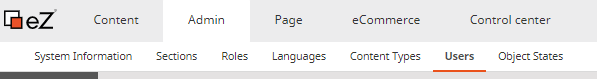
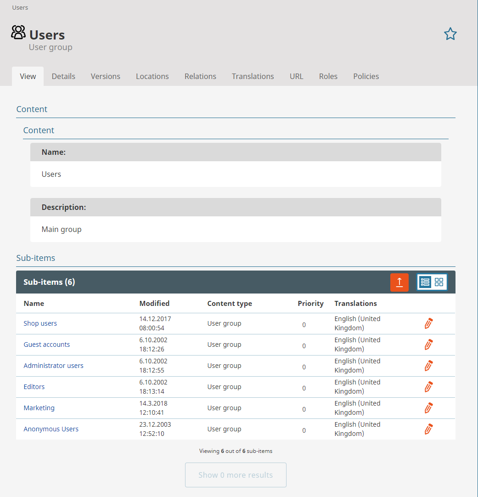
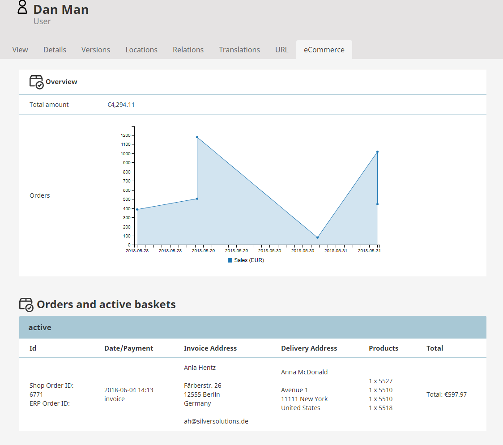
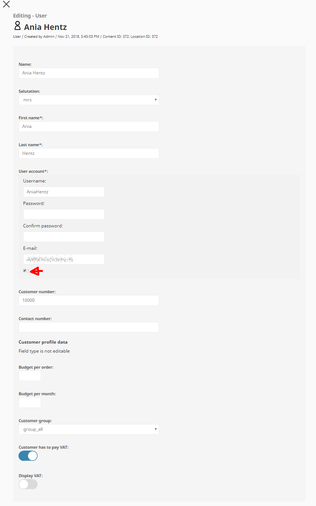
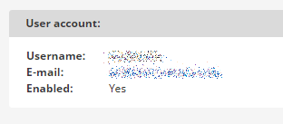

# Manage users

Users are stored in the "Users" tab of the shop backend.

## User groups

Users are grouped in diverse user groups.

To create a new user group click on the plus in the top right corner "Create".

Got to a user group to see all users belonging to this group. One user can belong to different user groups.

To find a user you can also use the search in the top left corner.

## User

There are eight different tabs for detailed information about one user. By clicking on the "eCommerce" tab you will find an overview of the users orders and active baskets.

## How to activate and deactivate users

Select a user account and click on "Edit" to change the user settings.

Clear the checkbox to deactivate or set the checkbox to activate a user.

Checkbox: enable account

Budget fields are related to Plugin Customer Center.

VAT control per user (will be overwritten by information from ERP)

The current Account status is shown in the view tab of a user.

## Change password or E-Mail

Click on the "Edit" button of a user to change the password or E-Mail.

You can type in a new password and E-Mail in the user account field.
