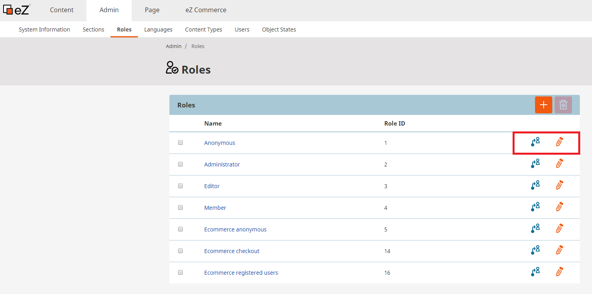
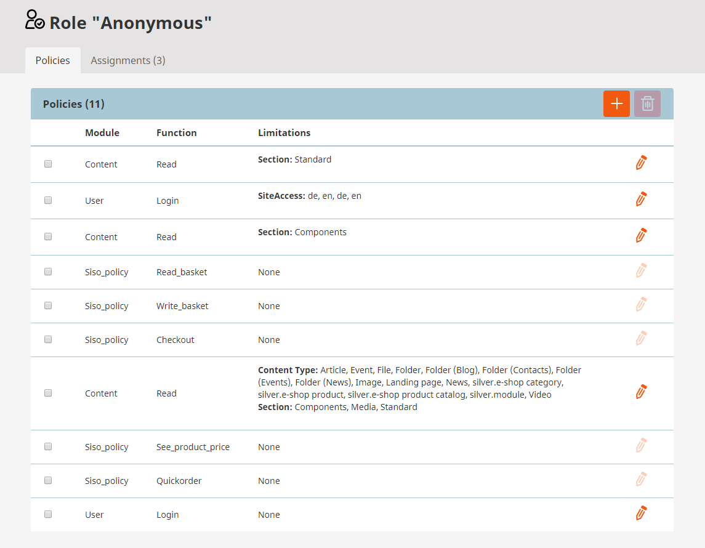
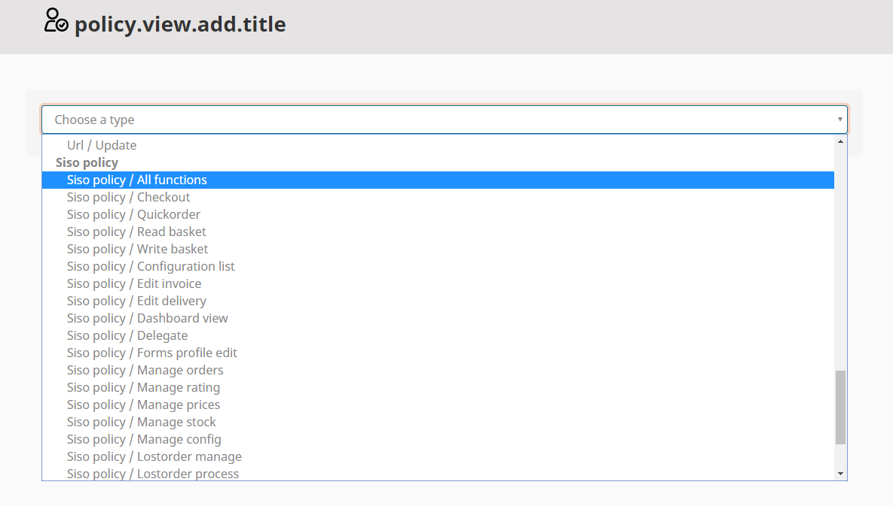

#  Roles and rights 

eZ Commerce comes with a roles & rights management system. It means that you can restrict access or functionality per user or user group. This management system can be used by the shop owner or editor using the Backend.

Per default there a the following roles:

| Role   | Functions   |
| -------| ------------|
| ecommerce anonymous  | This role enables a user to see the content and catalog. He can see prices and he can put products to the basket. |
| ecommerce checkout         | This role enables the user to go through the checkout and set an order.|
| ecommerce registered users | This role allows the user to manage the accounts of the registered users. |

## How to change roles and rights

First navigate to "Admin" -\> "Roles" and choose a role you want to modify. You can either assign the role to users or user groups or edit it. 

After clicking on a role you can add or remove policies or edit them. Every policy has a limitation behind. Description of policies will be described below.

To add a policy click on the plus and choose a type. eZ Commerce modules are: Siso policy.

## List of available eZ Commerce modules and functions

|Name|Description|
|--- |--- |
|Siso policy / All functions|user has no limitiations|
|Siso policy / Checkout|user can access checkout process|
|Siso policy / Quickorder|user can access quickorder functionality|
|Siso policy / Read basket|user can access his basket view|
|Siso policy / Write basket|user can add products to basket|
|Siso policy / Configuration list|user can access configurator in eZ backend|
|Siso policy / Edit invoice|user can edit invoice address in his profile|
|Siso policy / Edit delivery|user can edit delivery address in his profile|
|Siso policy / Dashboard view|user can access dashboard in eZ backend|
|Siso policy/ Forms profile edit|user can access profile editing|
|Siso policy / Manage orders|user can use the manage orders function in eZ backend|
|Siso policy / Manage rating|user can use the rate and review panel in eZ backend|
|Siso policy / Manage prices|user can manage prices in eZ backend|
|Siso policy / Manage stock|user can manage stock in eZ backend|
|Siso policy / Manage config|user can manage configuration settings in eZ backend|
|Siso policy / Order list|user can access his list of orders|
|Siso policy / See product price|user can see prices in the catalog, slider, product detail and comparison|
|Siso policy / Translations|user can change translations in ez backend|
|Siso policy / Rating review|user can use rating & review function|
|Siso policy / Red customers and orders|user can see the tabs 'last orders' and 'best clients' in the cockpit|
|Advanced version only||
|siso_customercener/approve|company user can approve/reject orders in customer center|
|siso_customercenter/buy|company user can buy products in customer center|
|siso_customercenter/view|company user can access customer center|
|Siso policy / Lostorder manage|user can access lost orders list in eZ backend|
|Siso policy / Lostorder process|user can process lost order (transfer it or remove it) in eZ backend|
|Siso policy / Lostorder list|user can access his list of lost orders in eZ backend|
|Siso policy / Delegate|user can use the delegate functionality|

