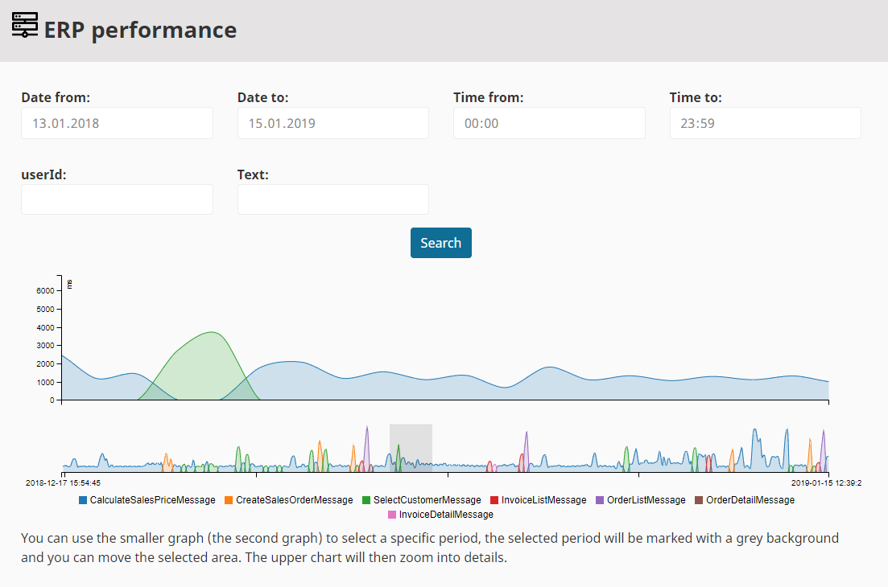

#  Shop administration 

eZ Commerce provides the following eCommerce functions in the top menu of the backend.

Depending on the chosen data provider and wether 3rd party software (ERP) has been integrated to the shop or not, there may be no data in some of the sub-tabs.

## eCommerce

|Tab|Description|
|--- |--- |
|[Cockpit](cockpit.md)|Basic statistics|
|[Order Management](manage_orders.md)|Basic order management|
|[Components](components.md)|- Provides a folder where translations are stored: [Translations for the shop](translations_for_the_shop/translations_for_the_shop.md) - Can provide additional content which is used by the shop for project specific information which will be not displayed directly (as a full page) in the shop.|
|[Configuration Settings](configuration_settings.md)|Basic shop configuration|
|[Price and stock management](manage_prices_and_stock.md)|Product price and stock management|

## Control Center

### ERP request log

Note: Only if an ERP system is connected!

All communication (request- and response messages), that is sent beetween shop and ERP system will be recorded and can bee seen here.

 
### ERP Performance

Note: Only if an ERP system is connected!

The ERP performance viewer shows the efficiency of the connection between the shop and the ERP system in a monitoring.It allows to see the number of the different requests per date and time.

The monitoring tool regularly checks the connection to the ERP via a test request.

If the connection has failed, the administrator receives an e-mail. If the connection is successful again, the alarm is ended by another e-mail.

### eMail archive

In the tab eMail archive the shop owner/admin finds all e-mails which were automatically sent from the shop, with date of despatch, recipient, subject and status. He can see the mails and resend them.

The eMail archive reduces the response time for the support and allows to resend an eMail to the customer.

### eContent

Note: Only if data provider is eContent!

If eContent is used as product data storage the shop owner can see all econtent types (product_group und product).

In the "eContent tasks" he can see how many products and product groups there are in the shop. Furthermore the shop operator can create a new index, import a backup into the database and create a backup from the database.

In the tab "eContent types" he can see the econtent types with their associated attributes (product_group and product) and the mapping information.

### eCommerce jobs

The shop is using jobs to perform recurring tasks such as imports, backups etc. The job system lists the last jobs and shows the status and result of the job. 

