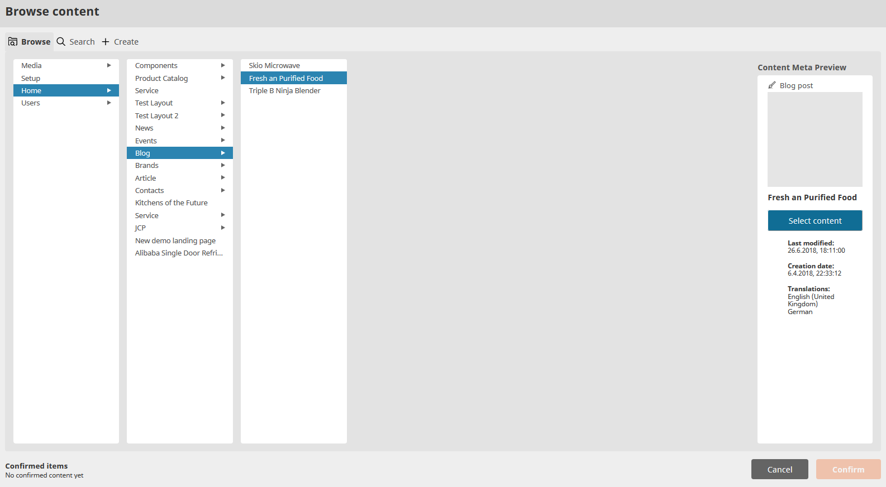
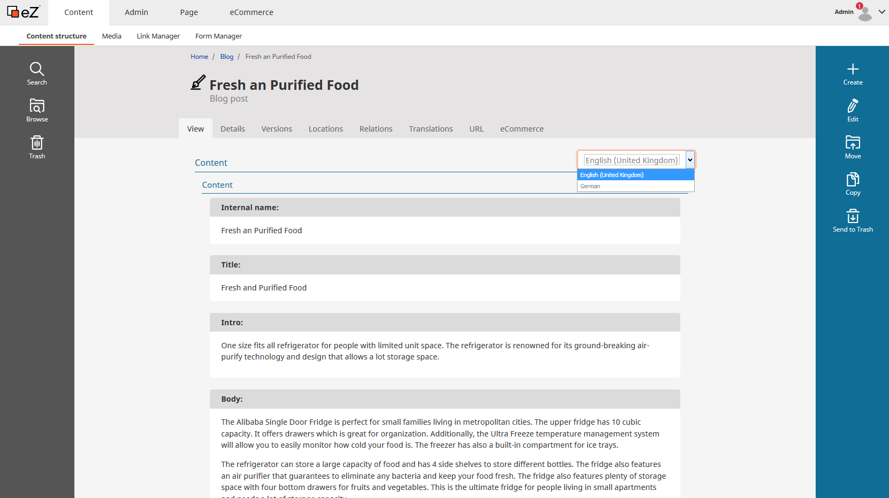

# Content translation

It is easy to add new translations to existing content, the following example shows how you can translate an object.

Go to the location where the content (e.g. "Terms & Conditions") is stored. Click on the gear wheel, choose "Edit in" and select "New translation":

You can select the new language from the language selection interface. The new translation can be based on already existing translations if necessary:

The last step is to fill the new translation with new content and send for publishing.

Also see <https://doc.ezplatform.com/projects/userguide/en/latest/creating_content_advanced>
 
