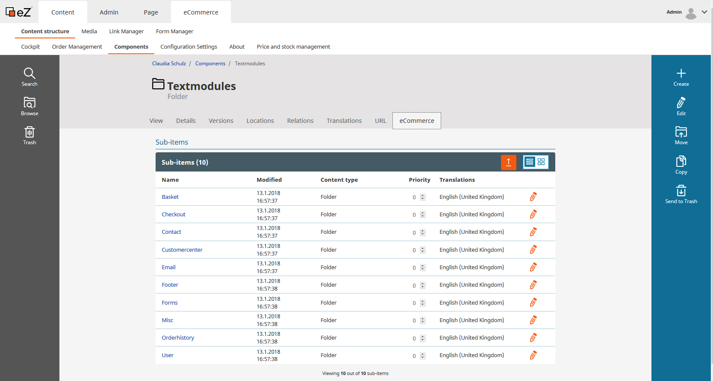

#  Translations for the shop 

There are 3 different types of translations:

1/. Content - [Content is translated directly](content_translation.md) in the CMS Backend. If products are stored in the eZ data provider they will be translated in the backend of the shop.

2/. Text modules - [Longer text elements](working_with_text_modules_longer_text_elements.md) can be translated in the backend offering more possibilities to format the text.

3/. One Sky translation platform - Short text elements such as labels and buttons are translated using the [translation platform OneSky](static_texts_short_text_elements_working_with_onesky.md).
