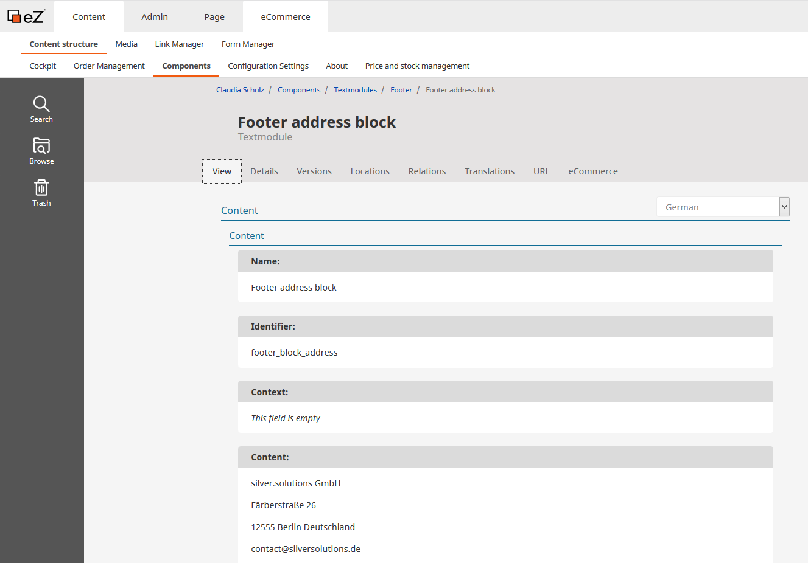
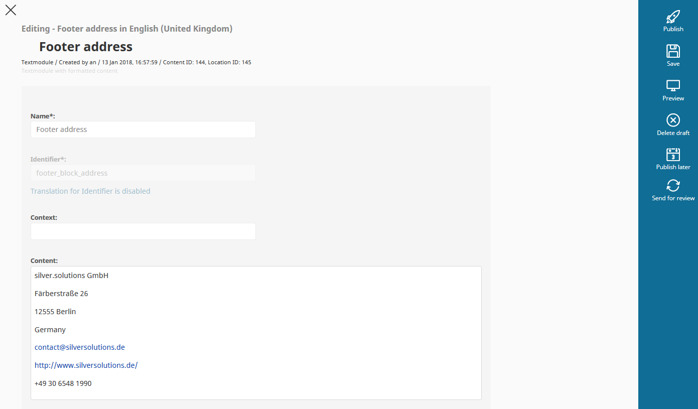
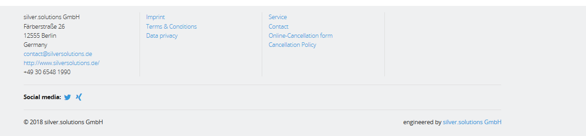

# Working with text modules (longer text elements)

## Introduction

Text module is a special eZ object in eZ Commerce. It allows the shop owner or editor to translate some of the text information in the shop. The text modules offer the possibility to use the WYSIWYG editor. 

For most situations, the text modules are used for some short explanatory texts in the shop. Every text module has it's own unique identifier in the shop.

This identifier must match exactly and must not be changed even with text changes. In the event that a text module has not yet been maintained, the identifier is displayed in the frontend.

## Example

In every project there is a need to add the address of the company in the footer (screenshot below)

In order to do so go to the "Components" section, then navigate to "Textmodules -\> Footer" and choose "Footer block address". 

To edit content of this eZ object please click on "Edit" and select the correct language (see screenshot below)

Next step is to create or modify the content and save it by clicking the "Publish" button.

You can see the result when you reload the page.

## Caching

The textmodules are cached. It is possible to [refresh the textmodules](../../../guide/caching_in_the_shop/content_cache_refresh/content_cache_refresh.md) when they are edited in the backend. Workflows and cronjob have to be configured for that.

However, if the full page is cached in HTTP cache, the new translation for the textmodule will appear after the HTTP cache expired, or was removed (worst case next day, since usually cache is removed during the night).
